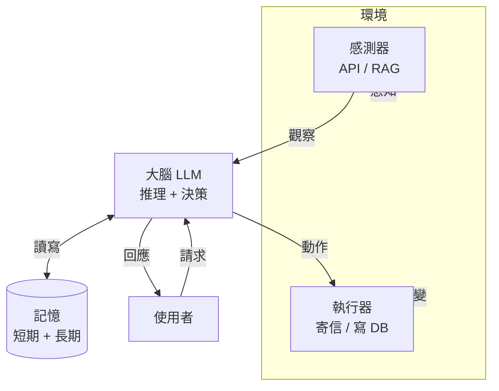
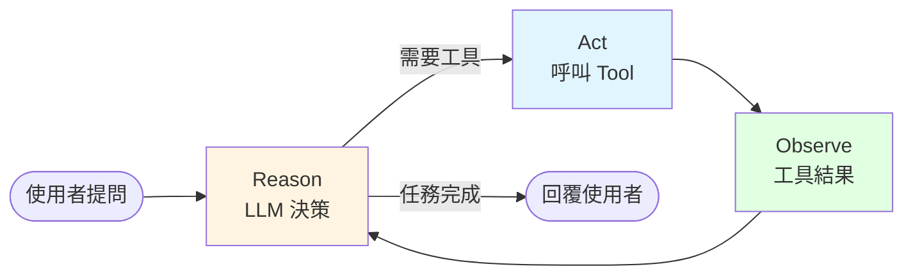

# 什麼是 AI Agent

**AI Agent** 是以 LLM 為核心,結合 **工具(tools)**、**知識(knowledge)** 與 **記憶(memory)** 的系統,使 LLM 能 **執行動作**,而不只是產生文字。

## 一句話定義

> Agent = LLM + Tools + Memory + Loop(思考 → 行動 → 觀察 → 再思考)

一般 ChatBot 收到訊息後回一段文字就結束;Agent 則會依任務判斷要呼叫哪個工具、觀察結果、再決定下一步,直到任務完成。

## Agent 的核心組成

| 組件 | 角色 | 範例 |
|------|------|------|
| **環境(Environment)** | Agent 運作的場域 | 訂票系統、檔案系統、瀏覽器 |
| **感測器(Sensors)** | 蒐集環境資訊 | API 查詢、RAG 檢索 |
| **執行器(Actuators)** | 改變環境 | 寄信、送出訂單、寫檔案 |
| **大腦(LLM)** | 推理與決策 | GPT-4o、Claude、Llama 3 |
| **記憶(Memory)** | 短期 + 長期 | 對話上下文、使用者偏好、歷史訂單 |

## Agent Loop(ReAct 循環)

Agent 的本質是一個迴圈 — Reason(想)→ Act(做)→ Observe(看結果)→ 再想:

## Agent 類型

| 類型 | 說明 | 旅行訂票情境 |
|------|------|-------------|
| **簡單反射** | 依預定規則即時反應 | 把負評信件轉給客服 |
| **基於模型** | 建立世界模型並依變化行動 | 根據歷史價格調整優先順序 |
| **目標導向** | 拆解目標、規劃步驟 | 自訂「從 A 到 B」的完整交通+住宿 |
| **效用導向** | 權衡多個因子 | 在便利與成本間找最佳解 |
| **學習型** | 從回饋改進 | 依旅後問卷優化下次推薦 |
| **階層式** | 高階 Agent 拆任務給低階 Agent | 取消行程 → 分發到各訂單的子 Agent |
| **多 Agent(MAS)** | 多 Agent 協作或競爭 | 合作:各負責飯店/航班/活動 |

## 何時該用 Agent?

適合 Agent 的情境有三個共同特徵:

1. **開放式問題** — 步驟無法事先寫死。
2. **多步驟流程** — 需要多回合使用工具。
3. **隨時間改善** — 需要依回饋迭代。

相反地,以下情境 **不需要** Agent:

- 單純的資料查詢(用 RAG 或直接查 DB 就好)
- 一問一答、無狀態(用一般 ChatBot)
- 結果必須可預測且不可出錯(規則引擎比 LLM 可靠)

:::warning
Agent 能力強但成本也高:每一步都要呼 LLM,延遲與費用都會放大。先問「能不能用更簡單的方式解?」
:::

## LangChain / LangGraph 的角色

| 工具 | 定位 |
|------|------|
| **LangChain** | 基礎零件庫:Model / Prompt / Tool / Retriever / Output Parser |
| **LangGraph** | 工作流引擎:State / Node / Edge / Checkpoint / HITL |
| **Observability** | 用 LangChain Callback / log 平台追蹤每一步(Ch 10) |

> 本課程先以 LangChain 搭基礎元件,接著用 LangGraph 組成實際可上線的 Agent。

## 討論題

1. 舉一個你生活中可以用 Agent 解決的問題。它屬於上面哪種類型?
2. 如果用一般 ChatBot 做同一件事,會遇到什麼瓶頸?
3. 你認為「隨時間學習」對企業應用最大的阻力是什麼?

## 延伸閱讀

- [Anthropic: Building Effective Agents](https://www.anthropic.com/research/building-effective-agents)
- LangChain 官方 [Agent 概念頁](https://docs.langchain.com/oss/python/langchain/agents)
- Microsoft 課程 [Lesson 01(zh-TW)](https://github.com/microsoft/ai-agents-for-beginners/blob/main/translations/zh-TW/01-intro-to-ai-agents/README.md)
