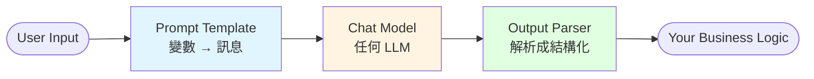

# LangChain 核心概覽

LangChain 最大的價值是把「跟 LLM 互動」抽象成一組 **標準元件**,任何模型、任何資料來源都能用同一套 API。

## 核心元件圖譜



以 LCEL(LangChain Expression Language)表達:

```python
chain = prompt | model | parser
result = chain.invoke({"topic": "AI"})
```

## 本章節涵蓋

| 主題 | 說明 |
|------|------|
| [Chat Model & Messages](./models-messages) | LLM 的統一介面、訊息類型 |
| [Prompt Template](./prompts) | 變數替換、few-shot |
| [Structured Output](./structured-output) | 讓 LLM 回傳指定 schema |
| [Streaming](./streaming) | 逐字輸出、即時 UX |

## Runnable 協定

所有 LangChain 元件都實作 `Runnable` 介面,提供五個標準方法:

| 方法 | 用途 |
|------|------|
| `invoke(input)` | 同步執行 |
| `ainvoke(input)` | 非同步 |
| `stream(input)` | 同步串流(generator) |
| `astream(input)` | 非同步串流 |
| `batch([...])` | 批次 |

記住這個介面,後面所有章節都在用。

## 最小可運行範例

```python
from langchain_openai import ChatOpenAI
from langchain_core.prompts import ChatPromptTemplate

llm = ChatOpenAI(model="gpt-4o-mini")
prompt = ChatPromptTemplate.from_messages([
    ("system", "你是{role},用繁體中文回答。"),
    ("human", "{question}"),
])

chain = prompt | llm
print(chain.invoke({
    "role": "資深 AI 工程師",
    "question": "LangChain 跟 LangGraph 差在哪?"
}).content)
```

接著看 [Chat Model & Messages](./models-messages)。
