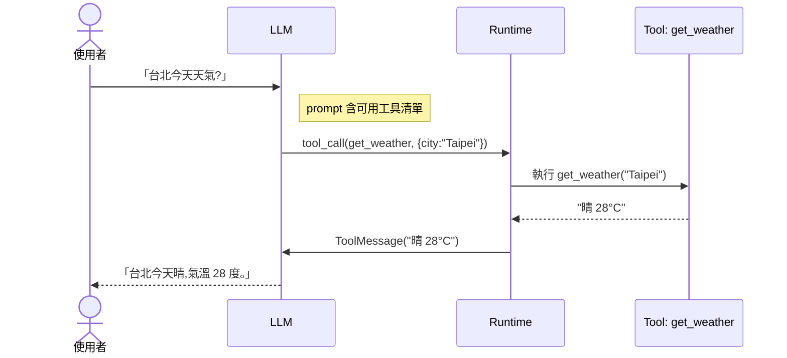

# Tool Use 概念

**Tool Use** 是 Agent 的「雙手」 — LLM 收到問題後,判斷要呼叫哪個函式、帶什麼參數,拿回結果後再回答。

## Tool Calling 的流程



關鍵觀念:

1. **LLM 不執行 tool**,它只決定「要叫哪個」。
2. **Runtime(你的程式)** 實際執行,再把結果塞回去。
3. LLM 收到結果後 **可能再呼叫下一個 tool**(Agent Loop)。

## 最小可運行範例

```python
from langchain_core.tools import tool
from langchain.chat_models import init_chat_model

@tool
def get_weather(city: str) -> str:
    """查詢指定城市的天氣"""
    return f"{city} 晴 28°C"

llm = init_chat_model(
    "gemma4-31b",
    model_provider="openai",
    base_url="http://192.168.1.101:4000/v1",
    api_key="sk-你的-token",
    max_tokens=1024,
)
llm_with_tools = llm.bind_tools([get_weather])

resp = llm_with_tools.invoke("台北今天天氣?")
print(resp.tool_calls)
# [{'name': 'get_weather', 'args': {'city': '台北'}, 'id': 'call_xxx', 'type': 'tool_call'}]
```

看到 `tool_calls` 就是 LLM 想要呼叫的清單。接下來要 **自己執行** 並把結果塞回:

```python
from langchain_core.messages import HumanMessage, ToolMessage

messages = [HumanMessage("台北天氣?")]
resp = llm_with_tools.invoke(messages)
messages.append(resp)

# 執行每一個 tool call
for tool_call in resp.tool_calls:
    result = get_weather.invoke(tool_call["args"])
    messages.append(ToolMessage(content=result, tool_call_id=tool_call["id"]))

# 把結果餵回 LLM
final = llm_with_tools.invoke(messages)
print(final.content)
```

這就是 **Agent Loop** 的雛形。在 Ch 05 用 LangGraph 會把這段自動化。

## Tool Schema

LLM 看到的不是你的 Python 程式,是 Tool 的 **schema**:

| 欄位 | 來源 |
|------|------|
| name | 函式名 |
| description | docstring |
| args schema | 型別註解 + `Field(description=...)` |

**docstring 極度重要** — LLM 用它判斷何時呼叫。

### 寫好 docstring 的原則

❌ 爛:
```python
@tool
def search(q):
    """搜尋"""
```

✅ 好:
```python
@tool
def search(query: str) -> str:
    """用 Google 搜尋網路即時資訊。
    適合查:新聞、股價、即時天氣、當前事件。
    不適合:常識、已訓練的知識。

    Args:
        query: 搜尋關鍵字,英文效果最好。
    """
```

## Tool 執行的安全

tools 會做「真實動作」(寫檔、呼 API、付款),風險遠高於純聊天。設計原則:

1. **最小權限** — 每個 tool 只能做一件事
2. **驗證輸入** — 不要信任 LLM 給的參數(SQL injection 還是會發生!)
3. **可還原** — 寫入類操作考慮 dry-run、log、undo
4. **人工確認** — 高風險動作(付款、刪資料)用 [HITL](../07-hitl/breakpoints.md)

## 討論題

1. 你寫過的第一個自訂 Tool 會是什麼?
2. LLM 判斷錯 tool、或帶錯參數時,怎麼偵測?
3. 開源模型的 tool calling 品質跟 GPT-4o 差在哪?

## 下一步

- [內建與常用 Tool](./builtin-tools)
- [自訂 Tool](./custom-tools)
- [Agent Loop 完整範例](./agent-tool-loop)
