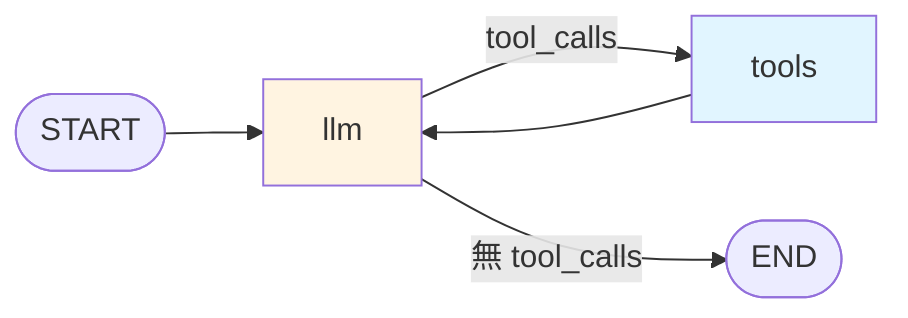

# 手刻 ReAct Agent

拆開 `create_agent` 的黑盒 — 用 StateGraph 親手組一個會呼工具的 Agent。

## 目標流程



## 完整程式

```python
from typing import Annotated
from typing_extensions import TypedDict
from langgraph.graph import StateGraph, START, END, MessagesState, add_messages
from langgraph.prebuilt import ToolNode, tools_condition
from langchain_core.messages import SystemMessage
from langchain_core.tools import tool
from langchain.chat_models import init_chat_model

# --- 1. Tools ---
@tool
def multiply(a: int, b: int) -> int:
    """兩數相乘"""
    return a * b

@tool
def add(a: int, b: int) -> int:
    """兩數相加"""
    return a + b

tools = [multiply, add]

# --- 2. LLM(綁 tools)---
llm = init_chat_model(
    "gemma4-31b",
    model_provider="openai",
    base_url="http://192.168.1.101:4000/v1",
    api_key="sk-你的-token",
    max_tokens=1024,
).bind_tools(tools)

# --- 3. Node ---
sys_msg = SystemMessage(content="你是數學助教,可以呼叫工具計算。")

def call_llm(state: MessagesState) -> dict:
    return {"messages": [llm.invoke([sys_msg] + state["messages"])]}

# --- 4. 組圖 ---
builder = StateGraph(MessagesState)
builder.add_node("llm", call_llm)
builder.add_node("tools", ToolNode(tools))

builder.add_edge(START, "llm")
builder.add_conditional_edges(
    "llm",
    tools_condition,  # 若 LLM 回 tool_calls → "tools";否則 → END
)
builder.add_edge("tools", "llm")

graph = builder.compile()

# --- 5. 執行 ---
result = graph.invoke({
    "messages": [("human", "(3 + 4) * 5 = ?")]
})

for m in result["messages"]:
    m.pretty_print()
```

## 每一行在做什麼

| 片段 | 說明 |
|------|------|
| `MessagesState` | 內建 state,含 `messages: Annotated[list, add_messages]` |
| `llm.bind_tools(tools)` | LLM 知道有哪些工具可用 |
| `ToolNode(tools)` | 內建節點:自動執行 tool_calls,把結果變成 ToolMessage |
| `tools_condition` | 內建路由:LLM 回 tool_calls → "tools",否則 → END |

## 與 `create_agent` 的關係

`create_agent(model, tools)` 其實就是幫你組這張圖。差別是:

- 用 `create_agent` — 快、但不易客製
- 親手組 StateGraph — 可加 HITL、自訂路由、插 middleware

會組這張圖,後續的 HITL / 多 Agent / RAG Agent 都是在這張圖上加東西。

## Stream 看每一步

```python
for chunk in graph.stream(
    {"messages": [("human", "(3+4)*5=?")]},
    stream_mode="values",
):
    chunk["messages"][-1].pretty_print()
```

會看到每一步 state 的最新訊息。

## 加入系統 prompt 的其他做法

除了用 `sys_msg`,也能在 node 前做 prompt:

```python
from langchain_core.prompts import ChatPromptTemplate

prompt = ChatPromptTemplate.from_messages([
    ("system", "你是數學助教"),
    ("placeholder", "{messages}"),
])

chain = prompt | llm

def call_llm(state: MessagesState) -> dict:
    return {"messages": [chain.invoke({"messages": state["messages"]})]}
```

## Ch 05 總結

- LangGraph = State + Node + Edge
- `MessagesState` + `add_messages` 是 Agent 的預設 state
- `ToolNode` + `tools_condition` 是 ReAct 的兩塊積木
- 會組這張圖,你就能客製任何 Agent 行為

下一章:**給 Agent 加記憶**。
