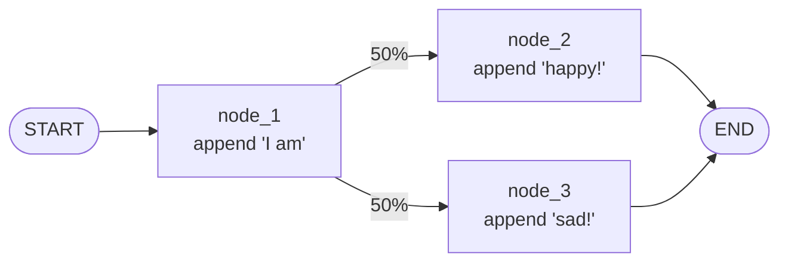

# 第一個 StateGraph

跟著 LangChain Academy Module 1 走一遍最簡單的圖。

## 目標

建一個有 **3 個節點、1 條 conditional edge** 的圖:



## Step 1:定義 State

State 就是節點間共享的資料結構。用 `TypedDict`:

```python
from typing_extensions import TypedDict

class State(TypedDict):
    graph_state: str
```

## Step 2:定義 Node

Node 是吃 state、回傳 **state 更新** 的函式。

```python
def node_1(state: State) -> dict:
    print("---Node 1---")
    return {"graph_state": state["graph_state"] + " I am"}

def node_2(state: State) -> dict:
    print("---Node 2---")
    return {"graph_state": state["graph_state"] + " happy!"}

def node_3(state: State) -> dict:
    print("---Node 3---")
    return {"graph_state": state["graph_state"] + " sad!"}
```

:::info
Node 回傳的 dict 是 **部分更新**,不是整個 state。預設行為是覆蓋對應 key。
:::

## Step 3:定義 Edge

- **直接 Edge**:永遠從 A 走到 B
- **Conditional Edge**:根據 state 決定要去哪

```python
import random
from typing import Literal

def decide_mood(state: State) -> Literal["node_2", "node_3"]:
    return "node_2" if random.random() < 0.5 else "node_3"
```

## Step 4:組裝 Graph

```python
from langgraph.graph import StateGraph, START, END

builder = StateGraph(State)
builder.add_node("node_1", node_1)
builder.add_node("node_2", node_2)
builder.add_node("node_3", node_3)

builder.add_edge(START, "node_1")
builder.add_conditional_edges("node_1", decide_mood)  # 回傳的字串就是下一個 node
builder.add_edge("node_2", END)
builder.add_edge("node_3", END)

graph = builder.compile()
```

## Step 5:視覺化

```python
from IPython.display import Image, display
display(Image(graph.get_graph().draw_mermaid_png()))
```

## Step 6:執行

```python
result = graph.invoke({"graph_state": "Hi, this is Lance."})
print(result)
# ---Node 1---
# ---Node 3---  (or Node 2)
# {'graph_state': 'Hi, this is Lance. I am sad!'}
```

## 串流執行

```python
for chunk in graph.stream({"graph_state": "Hi"}, stream_mode="values"):
    print(chunk)
```

每一步印出 state 的當前值。

## 重點整理

- `StateGraph(State)` — State 是 schema
- `add_node(name, fn)` — fn 是 `(state) -> dict`
- `add_edge(A, B)` — 永遠 A 後走 B
- `add_conditional_edges(A, fn)` — fn 回傳下一個 node name
- `compile()` — 做靜態檢查,回傳可執行的 `CompiledGraph`
- `START` / `END` — 特殊節點

## 練習

修改 `decide_mood`,讓它看 `state["graph_state"]` 裡有沒有「開心」兩個字來決定路線,而不是隨機。
