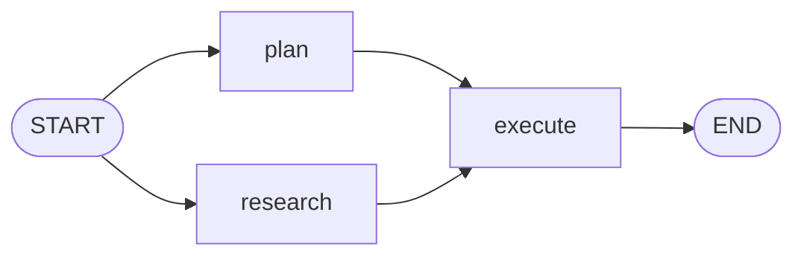
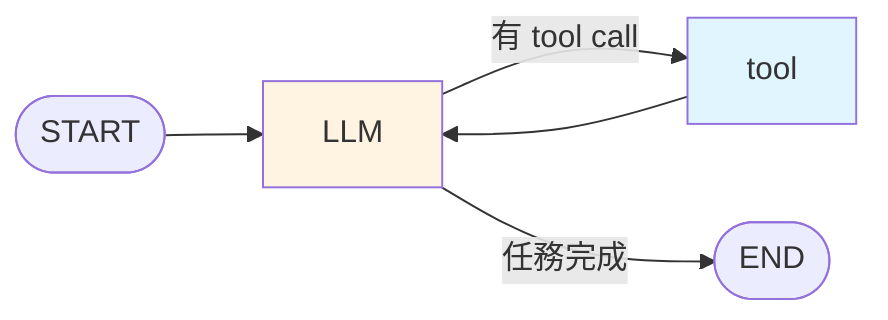

# 為什麼需要 LangGraph

到上一章為止,我們用 `create_agent()` 跑起 Agent。但一旦產品化,你會遇到:

- 「我想在某個分支加人工審核」
- 「我想在失敗時倒回上一步」
- 「我想讓這個 Agent 跑到一半停下來,等後端資料到齊再繼續」
- 「我想畫流程圖給老闆看」

這些需求,傳統的 `AgentExecutor` 做不到 — 因為它把 loop 寫死了。

**LangGraph 把 Agent 變成一張圖** — 你控制每個節點、每條邊、每個 state 變動。

## LangGraph 的三個核心概念

| 概念 | 等同 Python 的 |
|------|--------------|
| **State** | 全域變數(dict) |
| **Node** | 函式(接 State → 改 State) |
| **Edge** | if/else 流程控制 |

一張圖就是 State + Node + Edge 的組合,LangGraph 負責執行。

## 最小範例(3 個 node)

```python
from typing_extensions import TypedDict
from langgraph.graph import StateGraph, START, END

# 1. 定義 State
class State(TypedDict):
    count: int

# 2. 定義 Node
def node_a(state: State) -> dict:
    print("a")
    return {"count": state["count"] + 1}

def node_b(state: State) -> dict:
    print("b")
    return {"count": state["count"] * 2}

# 3. 組 Graph
builder = StateGraph(State)
builder.add_node("a", node_a)
builder.add_node("b", node_b)
builder.add_edge(START, "a")
builder.add_edge("a", "b")
builder.add_edge("b", END)
graph = builder.compile()

# 4. 執行
print(graph.invoke({"count": 3}))
# a
# b
# {'count': 8}   ← (3+1)*2
```

## 視覺化

```python
from IPython.display import Image
Image(graph.get_graph().draw_mermaid_png())
```

會得到一張 Mermaid 流程圖。教學時超好用。

## 為什麼叫 Graph 而不叫 Chain?

傳統 LangChain 的 chain 是線性:A → B → C。
Graph 可以有分支、迴圈、並行:



Agent 本質就是圖 — LLM 與 tool 之間的循環:



## 對比:Python while loop vs LangGraph

### 用 while 自己寫
```python
state = {"messages": [user_msg]}
while True:
    resp = llm_with_tools.invoke(state["messages"])
    state["messages"].append(resp)
    if not resp.tool_calls:
        break
    for tc in resp.tool_calls:
        result = tool_map[tc["name"]].invoke(tc["args"])
        state["messages"].append(ToolMessage(result, tool_call_id=tc["id"]))
```

### 用 LangGraph
```python
from langgraph.graph import StateGraph, START, END
from langgraph.prebuilt import ToolNode

builder = StateGraph(MessagesState)
builder.add_node("llm", call_model)
builder.add_node("tools", ToolNode(tools))
builder.add_edge(START, "llm")
builder.add_conditional_edges("llm", route_tools, ["tools", END])
builder.add_edge("tools", "llm")
graph = builder.compile()
```

看起來多幾行,但你免費拿到:

- ✅ **Checkpoint** — 可暫停、可恢復
- ✅ **Streaming** — 每個節點都能串流
- ✅ **HITL** — 任意節點可插入人工審核
- ✅ **視覺化** — 一行畫圖
- ✅ **Observability** — 每個節點都能獨立 log / trace

## 本章節後續

| 主題 | 說明 |
|------|------|
| [Simple Graph](./simple-graph) | 3-node 圖、conditional edge |
| [State & Reducer](./state-reducer) | 多節點如何共享資料 |
| [ReAct Agent](./react-agent) | 完整 Agent 範例 |
