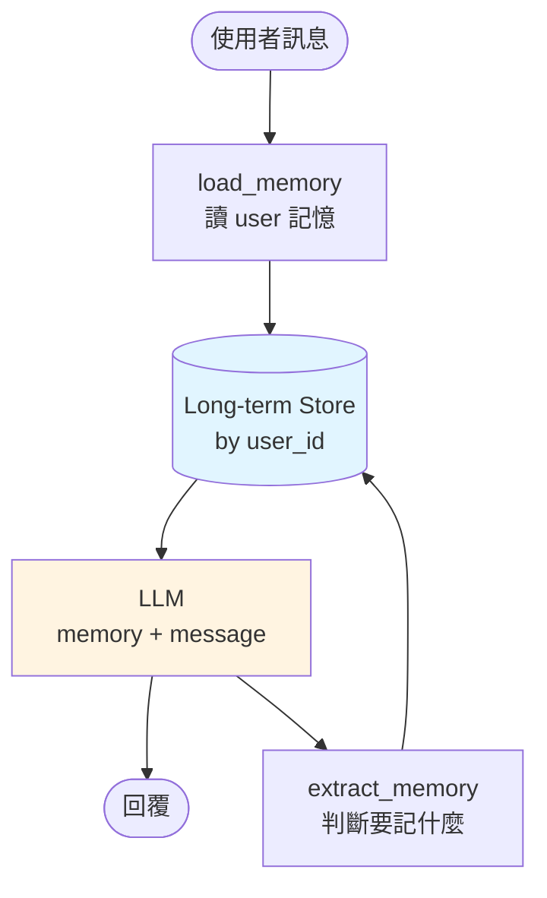

# 長期記憶(跨 Session)

短期記憶在 thread 內有效;**長期記憶** 跨 thread、跨使用者 session,例如:

- 使用者偏好(愛吃辣、只喝黑咖啡)
- 過去訂單、既定事實
- 個人化設定

## Store API

LangGraph 提供 `BaseStore` 作為 KV store 介面,內建 `InMemoryStore`、`PostgresStore`。

```python
from langgraph.store.memory import InMemoryStore

store = InMemoryStore()

# 寫
store.put(
    namespace=("memories", "user-harry"),
    key="preference-1",
    value={"content": "偏好繁體中文", "tags": ["language"]},
)

# 讀
items = store.search(
    ("memories", "user-harry"),
    query="語言偏好",
)
for item in items:
    print(item.value)
```

## 把 Store 接到 Graph

```python
graph = builder.compile(checkpointer=memory, store=store)
```

在 node 裡存取:

```python
def call_llm(state: MessagesState, config, *, store) -> dict:
    user_id = config["configurable"]["user_id"]
    # 讀使用者記憶
    memories = store.search(("memories", user_id), limit=5)
    mem_text = "\n".join(m.value["content"] for m in memories)

    sys = SystemMessage(f"關於此使用者:\n{mem_text}")
    resp = llm.invoke([sys] + state["messages"])
    return {"messages": [resp]}
```

## 記憶該存什麼?用 Schema 規範

Free-form 的記憶容易亂。用 Pydantic 規範格式:

### 例 1:單一 Profile(每使用者一份)

```python
from pydantic import BaseModel, Field
from langchain.chat_models import init_chat_model

class UserProfile(BaseModel):
    name: str | None
    preferred_language: str = "zh-TW"
    diet: list[str] = Field(default_factory=list, description="飲食限制,如素食、無麩質")
    timezone: str = "Asia/Taipei"

llm = init_chat_model(
    "gemma4-31b",
    model_provider="openai",
    base_url="http://192.168.1.101:4000/v1",
    api_key="sk-你的-token",
    max_tokens=1024,
)
extractor = llm.with_structured_output(UserProfile)
```

每次對話結束,讓 LLM 看這次對話 + 舊 profile → 產新 profile → store.put。

### 例 2:Collection(多條記憶)

```python
class Memory(BaseModel):
    content: str
    created_at: str
    tags: list[str] = []

class MemoryUpdate(BaseModel):
    new_memories: list[Memory] = []
    obsolete_ids: list[str] = []
```

每輪結束後,LLM 判斷:要新增什麼、哪些舊的已過時。

## 搜尋記憶(語意)

`InMemoryStore` 支援 embedding 檢索:

```python
from langchain_openai import OpenAIEmbeddings
from langgraph.store.memory import InMemoryStore

store = InMemoryStore(
    index={"embed": OpenAIEmbeddings(), "dims": 1536, "fields": ["content"]}
)

store.put(("mem", "u1"), "k1", {"content": "我最近在學 LangChain"})
store.put(("mem", "u1"), "k2", {"content": "昨天吃了壽司"})

# 語意搜尋
results = store.search(("mem", "u1"), query="使用者在學什麼?")
# 回 k1
```

## Memory Agent 流程



## 設計建議

- **記憶要寫成事實句**(「使用者偏好...」)而非對話 snippet
- **定期壓縮** — 數月後同一主題的多筆記憶合併
- **加時間戳** — 舊記憶會過時(住址、工作)
- **使用者可見** — 給使用者 UI 看/改自己的記憶,信任感比較高

## 課程小結(Ch 06)

- Short-term(Checkpointer) + Long-term(Store)是兩層
- Checkpointer 靠 thread_id,Store 靠 namespace(通常含 user_id)
- 訊息長了用 Trim / Summarize
- 長期記憶用 schema 管理,避免雜訊

下一章:**人工介入** — 讓 Agent 在某些決定前先問人。
