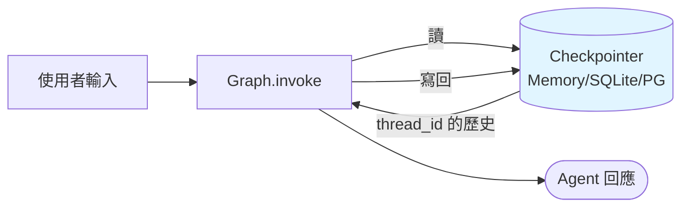

# 短期記憶(Thread Memory)

**短期記憶** = 單一對話的上下文。LangGraph 用 **Checkpointer** 處理。



## 沒有記憶會怎樣?

```python
graph = builder.compile()  # 沒 checkpointer
graph.invoke({"messages": [("human", "我叫 Harry")]})
graph.invoke({"messages": [("human", "我叫什麼?")]})
# LLM 不知道
```

每次 `invoke` 都是新 state,Agent 完全不記得上一輪。

## 加上 Checkpointer

```python
from langgraph.checkpoint.memory import MemorySaver

memory = MemorySaver()
graph = builder.compile(checkpointer=memory)

# 用 thread_id 區分對話
config = {"configurable": {"thread_id": "user-harry"}}

graph.invoke({"messages": [("human", "我叫 Harry")]}, config=config)
graph.invoke({"messages": [("human", "我叫什麼?")]}, config=config)
# LLM 能答 Harry 了
```

關鍵:

- **Checkpointer** 負責存/取 state
- **thread_id** 區分不同對話(使用者、session)
- 每次 `invoke`,LangGraph 會先讀該 thread 的 state,把新訊息 append 上去

## Checkpointer 選擇

| Checkpointer | 用途 |
|--------------|------|
| `MemorySaver` | 記憶體(測試、notebook) |
| `SqliteSaver` | 本機 sqlite |
| `PostgresSaver` | 生產 PG |
| `RedisSaver`(社群) | 低延遲分散式 |

Sqlite 範例:

```python
from langgraph.checkpoint.sqlite import SqliteSaver

memory = SqliteSaver.from_conn_string("agent.db")
graph = builder.compile(checkpointer=memory)
```

## 查看 / 修改 State

```python
# 目前狀態
snapshot = graph.get_state(config)
print(snapshot.values)         # 目前 state
print(snapshot.next)           # 下個要跑的 node

# 歷史
for snap in graph.get_state_history(config):
    print(snap.values, snap.next)

# 改 state(for HITL,下一章詳細)
graph.update_state(config, {"messages": [...]})
```

## thread_id 設計

- **一個使用者一個對話** — `thread_id = user_id`
- **一個使用者多個會話** — `thread_id = f"{user_id}:{session_id}"`
- **跨使用者共享** — `thread_id = "team-channel-xxx"`

```python
# 切 thread 等於切對話
config_a = {"configurable": {"thread_id": "alice"}}
config_b = {"configurable": {"thread_id": "bob"}}
# 各自獨立,互不干擾
```

## 記憶有什麼限制?

Short-term memory 存的是 **訊息列表**,每輪都全部塞給 LLM。對話一長就會遇到:

1. **Context overflow** — 超過 LLM context window
2. **Token 成本爆炸** — 每輪都付一次舊訊息的錢
3. **關鍵資訊被稀釋** — 舊訊息太多,LLM 忽略重要資訊

解法看下一節 [摘要](./summarization.md) 與 Trim。

## 練習

1. 用 `MemorySaver` + `thread_id` 跑一個 5 輪對話,觀察 state 累積。
2. 換 `SqliteSaver`,重啟 Python 後能不能恢復前一次對話?
