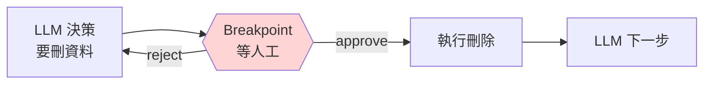

# Breakpoint 中斷點

讓 Agent 在特定節點 **停下來**,等你允許再繼續 — 高風險操作必備。



## 靜態 breakpoint

`compile` 時指定在哪個 node **之前** 停:

```python
graph = builder.compile(
    checkpointer=memory,
    interrupt_before=["tools"],    # 呼叫 tool 前停
)
```

或 **之後** 停:

```python
graph = builder.compile(
    checkpointer=memory,
    interrupt_after=["llm"],
)
```

## 完整範例

```python
from langgraph.prebuilt import ToolNode, tools_condition
from langgraph.graph import StateGraph, START, END, MessagesState
from langgraph.checkpoint.memory import MemorySaver

@tool
def delete_user(user_id: str) -> str:
    """刪除使用者帳號"""
    # ... 危險操作
    return f"user {user_id} deleted"

tools = [delete_user]
llm_with_tools = llm.bind_tools(tools)

def call_llm(state): return {"messages": [llm_with_tools.invoke(state["messages"])]}

builder = StateGraph(MessagesState)
builder.add_node("llm", call_llm)
builder.add_node("tools", ToolNode(tools))
builder.add_edge(START, "llm")
builder.add_conditional_edges("llm", tools_condition)
builder.add_edge("tools", "llm")

graph = builder.compile(
    checkpointer=MemorySaver(),
    interrupt_before=["tools"],   # ← 呼工具前停
)

config = {"configurable": {"thread_id": "1"}}
# 第一次 invoke,會停在 tools 前
for chunk in graph.stream(
    {"messages": [("human", "刪除 user 42")]},
    config=config, stream_mode="values",
):
    chunk["messages"][-1].pretty_print()

# 檢查要跑什麼
snapshot = graph.get_state(config)
print("下個 node:", snapshot.next)
# ('tools',)

# 使用者確認後,繼續執行(傳 None)
for chunk in graph.stream(None, config=config, stream_mode="values"):
    chunk["messages"][-1].pretty_print()
```

## 使用者拒絕時

把下一步 node 跳掉即可:

```python
# 使用者說不要執行
snapshot = graph.get_state(config)

# 手動注入一條「已拒絕」訊息,並讓 Agent 走回 llm
from langchain_core.messages import ToolMessage
tool_call_id = snapshot.values["messages"][-1].tool_calls[0]["id"]

graph.update_state(
    config,
    {"messages": [ToolMessage(
        content="使用者拒絕執行此動作",
        tool_call_id=tool_call_id,
    )]},
)

# 繼續,Agent 會看到「被拒絕」訊息,重新想
for chunk in graph.stream(None, config=config, stream_mode="values"):
    chunk["messages"][-1].pretty_print()
```

## 哪些地方該 breakpoint?

| 動作類型 | 建議 |
|---------|------|
| 寄送通知(email / slack) | 一律 interrupt |
| 金流 / 扣款 | 一律 interrupt |
| 刪資料 | 一律 interrupt |
| 讀資料 | 不需 |
| 記日誌 | 不需 |
| 修改客戶資料 | interrupt(視情境) |

## 下一節

- [動態 Breakpoint](#dynamic)(只在特定條件中斷)
- [編輯 State](./edit-state.md)
- [Time Travel](./time-travel.md)

## 動態 Breakpoint {#dynamic}

靜態 breakpoint 是「永遠在某節點前停」。如果你想「只有當金額 > 10000 才停」,要用 `NodeInterrupt`:

```python
from langgraph.errors import NodeInterrupt

def payment_node(state):
    amount = state["payment"]["amount"]
    if amount > 10000:
        raise NodeInterrupt(f"金額 {amount} 超過 10000,需人工核准")
    # ... 正常執行
    return {...}
```

執行到這個 node,金額夠大就會 interrupt,人工核准後再繼續。

## 練習

改造 [Ch 04 agent loop](../04-tools/agent-tool-loop.md),在 `delete_` 開頭的工具呼叫前都 interrupt。
