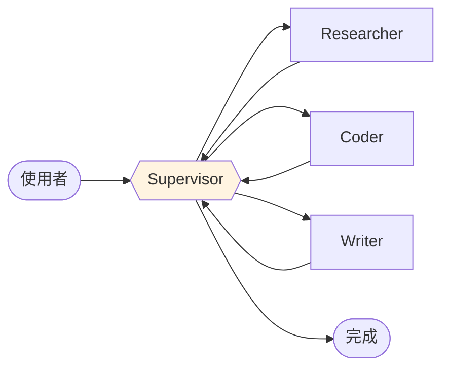
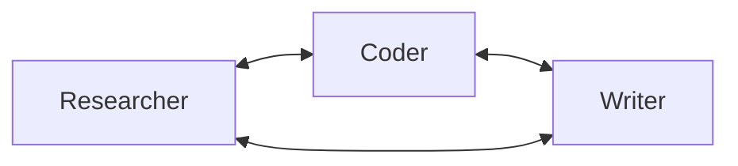
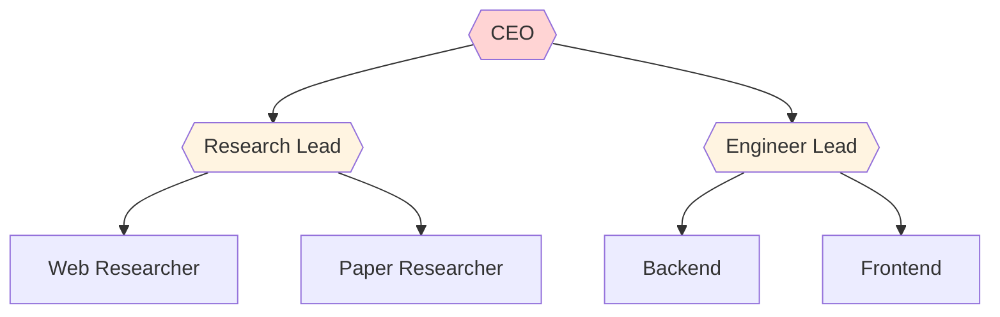
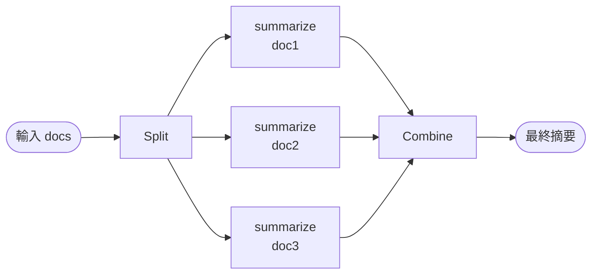

# Multi-Agent 模式

單 Agent 強在「小而精」;多 Agent 強在「分工與可並行」。常見模式有 4 種。

## 1. Supervisor(最常用)

一個 **Supervisor Agent** 負責決策「把這任務丟給哪個 Worker」,Worker 做完回報給 Supervisor。



適合:明確分工,每個 Agent 有專精領域。

## 2. Swarm(去中心化)

Agent 之間 **自行 handoff**,沒有中心。



適合:Agent 之間有明確的 handoff 條件,不需中心協調。

## 3. Hierarchical(階層)

Supervisor 底下還有 Supervisor。



適合:複雜專案、團隊超過 5 個 Agent。

## 4. Map-Reduce(平行分工)

同時對多筆資料做同樣事,最後彙整。



適合:批次摘要、平行搜尋。

## 選擇指南

| 需求 | 選 |
|------|---|
| 明確任務類型,想專精化 | Supervisor |
| Agent 角色相近、互補 | Swarm |
| 團隊大、職責分層 | Hierarchical |
| 資料多、要同時處理 | Map-Reduce |

## 共通實作骨架

無論哪種模式,LangGraph 的表達方式都是:

```python
builder = StateGraph(SharedState)
builder.add_node("supervisor", supervisor_agent)
builder.add_node("researcher", research_agent)
builder.add_node("coder", code_agent)
builder.add_conditional_edges("supervisor", route_to_worker)
builder.add_edge("researcher", "supervisor")
builder.add_edge("coder", "supervisor")
```

關鍵是 **共享 state**(訊息、任務、結果),讓 Agent 交換情報。

## 本章節涵蓋

- [Supervisor 範例](./supervisor)
- [平行化(parallelization)](./parallelization)
- [研究助理實作](./research-assistant)

## 延伸

- LangChain 官方 [Multi-Agent 文件](https://docs.langchain.com/oss/python/langchain/multi-agent)
- [Microsoft AI Agents for Beginners — Multi-Agent 章節](https://github.com/microsoft/ai-agents-for-beginners/blob/main/translations/zh-TW/08-multi-agent/README.md)
