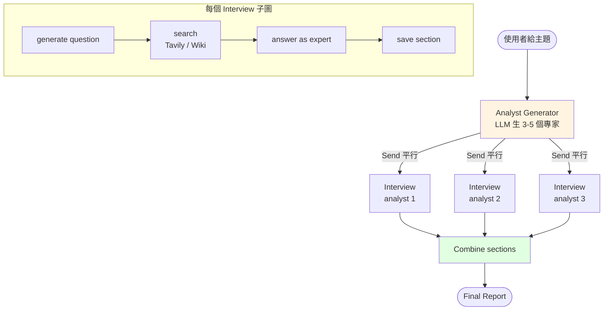

# 實戰:研究助理

整合前面所學,做一個 **Research Assistant**(參考 LangChain Academy Module 4)。

## 需求

- 使用者給一個主題
- Agent 自動產生多個子題
- 每個子題平行搜尋 → 訪談虛擬專家
- 最後統整成一篇報告

## 架構



## 關鍵程式片段

### 產生 Analysts

```python
from pydantic import BaseModel, Field

class Analyst(BaseModel):
    name: str
    persona: str
    expertise: str

class AnalystList(BaseModel):
    analysts: list[Analyst] = Field(description="3-5 個多元角度的專家")

def generate_analysts(state):
    topic = state["topic"]
    gen = llm.with_structured_output(AnalystList)
    result = gen.invoke(f"為主題「{topic}」設計 3-5 個不同角度的訪談專家")
    return {"analysts": result.analysts}
```

### 平行訪談(Send)

```python
from langgraph.types import Send

def initiate_interviews(state):
    return [
        Send("interview", {"analyst": a, "topic": state["topic"]})
        for a in state["analysts"]
    ]
```

### 訪談子圖

```python
class InterviewState(MessagesState):
    analyst: Analyst
    topic: str
    section: str

def ask_question(state):
    prompt = f"你是 {state['analyst'].name}({state['analyst'].expertise})。關於 {state['topic']},問一個深度問題。"
    q = llm.invoke(prompt).content
    return {"messages": [HumanMessage(q)]}

def search_and_answer(state):
    # 查資料(略)
    # 用 LLM 假扮專家回答
    ...

def save_section(state):
    last = state["messages"][-1].content
    return {"section": f"## {state['analyst'].name}\n{last}"}

interview = StateGraph(InterviewState)
interview.add_node("ask", ask_question)
interview.add_node("search", search_and_answer)
interview.add_node("save", save_section)
# ...
interview_graph = interview.compile()
```

### 組裝 Main Graph

```python
class MainState(TypedDict):
    topic: str
    analysts: list[Analyst]
    sections: Annotated[list[str], add]
    report: str

def combine(state):
    body = "\n\n".join(state["sections"])
    return {"report": f"# {state['topic']}\n\n{body}"}

builder = StateGraph(MainState)
builder.add_node("gen_analysts", generate_analysts)
builder.add_node("interview", interview_graph)   # ← 子圖當 node
builder.add_node("combine", combine)

builder.add_edge(START, "gen_analysts")
builder.add_conditional_edges("gen_analysts", initiate_interviews, ["interview"])
builder.add_edge("interview", "combine")
builder.add_edge("combine", END)

main = builder.compile()
```

## 執行

```python
result = main.invoke({"topic": "vLLM on edge devices"})
print(result["report"])
```

會看到 3-5 個專家視角組成的報告。

## 可擴充點

- 加入 HITL:generate_analysts 後先讓使用者審核專家名單
- 加入 Critic:每個 section 寫完後讓 critic 審稿
- 換 LLM:複雜統整用 gpt-4o / Claude,個別訪談用 mini

## Ch 08 總結

- **Supervisor / Swarm / Hierarchical / Map-Reduce** 是四大模式
- **子圖** 把複雜流程封裝成單一 node
- **Send** 是動態 fan-out 的利器
- **reducer**(`add` 等)讓多路結果能合併

下一章:**RAG 與 Agentic RAG**。
