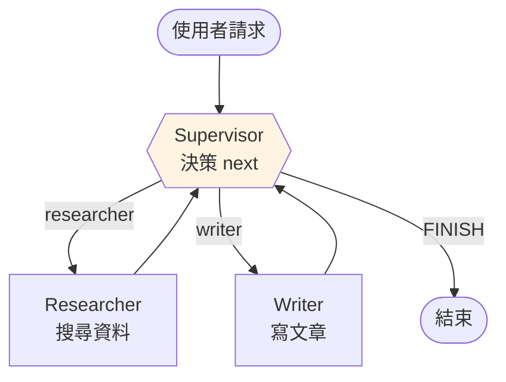

# Supervisor 範例

做一個「研究 + 寫作」雙 Agent:Supervisor 決定下一步,Researcher 查資料,Writer 寫稿。



## State 設計

```python
from typing import Annotated, Literal
from langgraph.graph import MessagesState

class Team(MessagesState):
    next: str  # "researcher" / "writer" / "FINISH"
```

## Supervisor 節點

```python
from pydantic import BaseModel
from langchain.chat_models import init_chat_model

class Route(BaseModel):
    next: Literal["researcher", "writer", "FINISH"]

llm = init_chat_model("gpt-4o-mini", model_provider="openai")
supervisor_llm = llm.with_structured_output(Route)

SUPERVISOR_PROMPT = """你是主管,管理兩個 worker:
- researcher:負責搜尋網路、找資料
- writer:負責把資料寫成文章

根據目前對話,決定下一步交給誰。
如果已完成使用者需求,回 FINISH。
"""

def supervisor(state: Team) -> dict:
    prompt = [("system", SUPERVISOR_PROMPT)] + [
        (m.type, m.content) for m in state["messages"]
    ]
    decision = supervisor_llm.invoke(prompt)
    return {"next": decision.next}
```

## Worker 節點

```python
from langchain_tavily import TavilySearch
from langchain_core.messages import AIMessage
from langchain.agents import create_agent

researcher = create_agent(
    model=llm,
    tools=[TavilySearch(max_results=3)],
    prompt="你是研究員,只負責蒐集資料。做完後用一段話總結發現。",
)

def researcher_node(state: Team) -> dict:
    result = researcher.invoke({"messages": state["messages"]})
    return {
        "messages": [
            AIMessage(result["messages"][-1].content, name="researcher")
        ]
    }

writer = create_agent(model=llm, tools=[], prompt="你是寫手,根據資料寫簡潔的文章。")

def writer_node(state: Team) -> dict:
    result = writer.invoke({"messages": state["messages"]})
    return {
        "messages": [
            AIMessage(result["messages"][-1].content, name="writer")
        ]
    }
```

## 路由函式

```python
from langgraph.graph import END

def route(state: Team) -> str:
    return state["next"] if state["next"] != "FINISH" else END
```

## 組圖

```python
from langgraph.graph import StateGraph, START

builder = StateGraph(Team)
builder.add_node("supervisor", supervisor)
builder.add_node("researcher", researcher_node)
builder.add_node("writer", writer_node)

builder.add_edge(START, "supervisor")
builder.add_conditional_edges("supervisor", route, ["researcher", "writer", END])
builder.add_edge("researcher", "supervisor")
builder.add_edge("writer", "supervisor")

graph = builder.compile()
```

## 執行

```python
for chunk in graph.stream(
    {"messages": [("human", "幫我寫一篇 300 字的 LangGraph 簡介")]},
    stream_mode="values",
):
    chunk["messages"][-1].pretty_print()
```

預期流程:
1. Supervisor → researcher
2. Researcher 搜尋,回 summary
3. Supervisor → writer
4. Writer 寫稿
5. Supervisor → FINISH

## 進階:加 max_steps 與失敗處理

```python
def route(state: Team) -> str:
    # 超過 10 step 強制結束
    if len(state["messages"]) > 20:
        return END
    return state["next"] if state["next"] != "FINISH" else END
```

## 練習

加一個 `critic` worker,負責檢查 writer 的稿。Supervisor 要學會 writer 寫完 → critic 看 → 不行就退回 writer。
