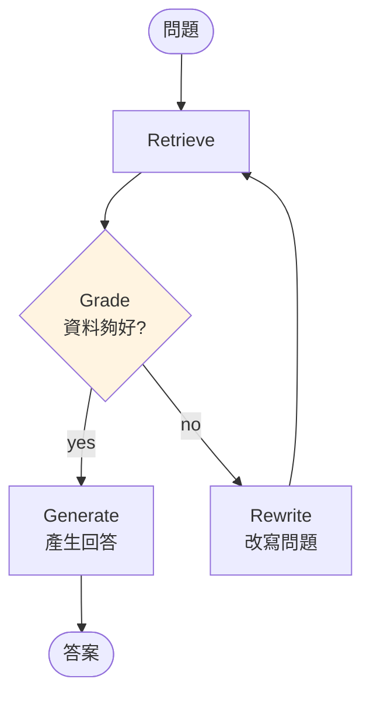

# Agentic RAG

傳統 RAG:使用者問 → 固定查一次 → 回答。
**Agentic RAG**:LLM 自己決定 **要不要查、查幾次、查什麼**。

## 為什麼?

傳統 RAG 有兩個盲點:

1. 每次都查 — 常識問題也浪費一次檢索
2. 查一次就答 — 結果不足時不會再查

Agentic RAG 把 Retriever 做成 tool,讓 Agent loop 決定。

## 最小 Agentic RAG

```python
from langchain.tools.retriever import create_retriever_tool
from langgraph.prebuilt import create_agent

retriever_tool = create_retriever_tool(
    retriever=vs.as_retriever(search_kwargs={"k": 4}),
    name="search_docs",
    description="查公司文件。使用前先判斷是否需要 — 一般常識問題不需要查。",
)

agent = create_agent(
    model=llm,
    tools=[retriever_tool],
    prompt="""你是公司助理。
- 一般常識題直接答,不要查文件
- 涉及公司規章、流程、同仁時,一定要查文件
- 找不到相關文件就說不知道,不要編造""",
)

result = agent.invoke({
    "messages": [("human", "我們公司的產假有幾天?")]
})
```

Agent 會判斷:「這是公司規章問題 → 呼 search_docs → 看結果 → 回答」。
純聊天(「Python 是什麼」)則不會呼 tool。

## Corrective RAG(CRAG)流程



## 加 Self-Correction:答不好就再查

```python
from typing import Literal

class GradeState(MessagesState):
    question: str
    docs: list[str]

def retrieve(state):
    q = state["messages"][-1].content
    docs = vs.similarity_search(q, k=4)
    return {"question": q, "docs": [d.page_content for d in docs]}

def grade(state) -> Literal["generate", "rewrite"]:
    prompt = f"問題:{state['question']}\n資料:{state['docs']}\n\n資料能回答問題嗎?回 yes/no"
    decision = llm.invoke(prompt).content.strip().lower()
    return "generate" if "yes" in decision else "rewrite"

def rewrite(state):
    q = state["question"]
    new_q = llm.invoke(f"改寫這個問題讓檢索更準確:{q}").content
    # 用新 query 更新最後一條訊息
    return {"messages": [HumanMessage(new_q)]}

def generate(state):
    ctx = "\n\n".join(state["docs"])
    prompt = f"根據資料回答:{state['question']}\n\n資料:{ctx}"
    return {"messages": [llm.invoke(prompt)]}

builder = StateGraph(GradeState)
builder.add_node("retrieve", retrieve)
builder.add_node("rewrite", rewrite)
builder.add_node("generate", generate)
builder.add_edge(START, "retrieve")
builder.add_conditional_edges("retrieve", grade, ["generate", "rewrite"])
builder.add_edge("rewrite", "retrieve")
builder.add_edge("generate", END)
```

這是 **Corrective RAG(CRAG)** 的雛形:找不到就改寫再查。

## Adaptive RAG(再進階)

根據問題類型選不同處理:

```python
def route(state) -> Literal["web_search", "vector_search", "llm_only"]:
    q = state["messages"][-1].content
    # LLM 分類
    decision = classifier.invoke(q)  # 回 web_search / vector_search / llm_only
    return decision
```

| Route | 用什麼 |
|-------|-------|
| `web_search` | 即時新聞、股價(Tavily) |
| `vector_search` | 公司內部資料(vector store) |
| `llm_only` | 常識、閒聊 |

## 加 Citation(引用)

```python
def generate_with_citation(state):
    ctx_parts = [
        f"[{i}] {d.page_content} (來源:{d.metadata.get('source','?')})"
        for i, d in enumerate(state["docs"])
    ]
    ctx = "\n\n".join(ctx_parts)
    prompt = f"""根據以下資料回答,務必在結尾列出 [1][2] 等引用編號:

{ctx}

問:{state['question']}
"""
    return {"messages": [llm.invoke(prompt)]}
```

## Ch 09 總結

- **RAG 基礎** = split + embed + retrieve + prompt
- **進階檢索** = Hybrid / Rerank / MultiQuery / SelfQuery
- **Agentic RAG** = retriever 當 tool,LLM 自己決定
- **CRAG** = 查不到就改寫再查
- **Citation** = 回答必附來源

下一章:**生產部署**。
