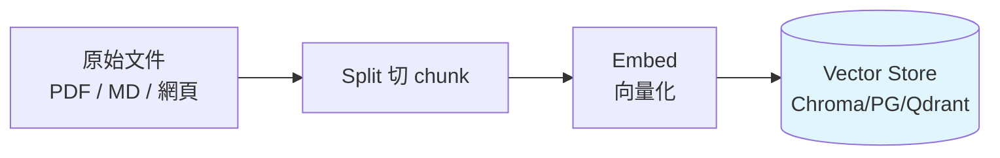
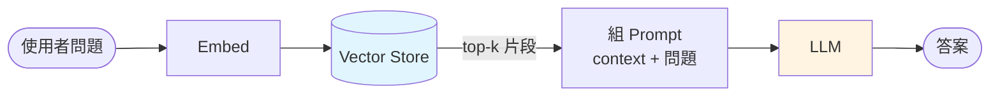

# RAG 基礎

**RAG(Retrieval-Augmented Generation)** = 檢索增強生成。LLM 不知道你的資料時,先 **查** 再 **答**。

## 為什麼要 RAG?

- LLM 訓練截止後的新資料它不知道
- 公司內部文件沒在訓練資料裡
- 把完整文件塞進 prompt 太貴、上下文不夠

RAG 讓 LLM 針對「相關片段」回答,而不是硬背所有文件。

## 三步驟流程

**階段一:Index(建索引,一次就好)**



**階段二:Query(每次問答)**



## 最簡 RAG(10 行)

```python
from langchain_community.document_loaders import TextLoader
from langchain_text_splitters import RecursiveCharacterTextSplitter
from langchain_openai import OpenAIEmbeddings
from langchain_chroma import Chroma
from langchain.chat_models import init_chat_model

# 1. Load
docs = TextLoader("company_handbook.txt").load()

# 2. Split
splitter = RecursiveCharacterTextSplitter(chunk_size=800, chunk_overlap=100)
chunks = splitter.split_documents(docs)

# 3. Embed + Store
vs = Chroma.from_documents(chunks, OpenAIEmbeddings(), persist_directory="./vs")

# 4. Retrieve
retriever = vs.as_retriever(search_kwargs={"k": 4})

# 5. Generate
llm = init_chat_model("gpt-4o-mini", model_provider="openai")

def rag(q: str) -> str:
    context = "\n\n".join(d.page_content for d in retriever.invoke(q))
    prompt = f"根據以下資料回答,找不到就說不知道:\n\n{context}\n\n問:{q}"
    return llm.invoke(prompt).content

print(rag("公司的休假規定是什麼?"))
```

## Chunking 策略

| Splitter | 怎麼切 | 適合 |
|----------|-------|------|
| `RecursiveCharacterTextSplitter` | 依段落、句號、空格層次切 | 通用文件 |
| `MarkdownHeaderTextSplitter` | 依 H1/H2/H3 切 | 文件、wiki |
| `TokenTextSplitter` | 依 token 切 | 精確控成本 |
| `SemanticChunker` | 語意相似度切 | 最貴、最準 |

**通用設定**:`chunk_size=800`,`chunk_overlap=100`。太大 LLM 看不清,太小會遺失上下文。

## Embedding 選擇

| 模型 | 維度 | 成本 | 品質 |
|------|-----|------|------|
| `text-embedding-3-small`(OpenAI) | 1536 | 便宜 | 通用高 |
| `text-embedding-3-large` | 3072 | 中 | 最高 |
| `jina-embeddings-v2`(本地) | 768 | 免費 | 中 |
| `bge-m3`(本地) | 1024 | 免費 | 高,多語 |

本地 embedding:

```python
from langchain_huggingface import HuggingFaceEmbeddings
emb = HuggingFaceEmbeddings(model_name="BAAI/bge-m3")
```

## Vector Store 選擇

| Store | 部署 | 特色 |
|-------|-----|------|
| Chroma | 本地 / in-memory | 教學首選 |
| PGVector | Postgres 擴充 | 已有 PG 就用 |
| Qdrant | 獨立服務 | 生產常見 |
| Pinecone | 雲端 | 零維運 |
| pgvector-on-pg | Postgres | 企業相容 |

## 做對 RAG 的 7 個要點

1. **Chunk 要有語意完整性** — 切在段落,別切在句中
2. **保留 metadata** — 來源、作者、日期 → filter 用
3. **Hybrid Search** — 向量 + 關鍵字
4. **Rerank** — top-20 向量 → rerank → top-4 塞 prompt
5. **Query 改寫** — 使用者問法 → 標準化查詢
6. **答不出來就說不知道** — prompt 一定要寫
7. **Observability** — 用 callback / log 記錄每次檢索到什麼

## 檢查清單

跑 RAG 不出結果時依序查:

- [ ] Embedding 模型一致嗎?(index / query 用同一個)
- [ ] Chunk 太小/太大?
- [ ] top-k 太少?試 k=8/10
- [ ] 用 metadata filter 過濾了不相關資料嗎?
- [ ] Prompt 有明確說「只根據 context 答」嗎?

## 下一節

- [Vector Store 進階](./vector-stores)
- [Retriever 進階](./retrievers)
- [Agentic RAG](./agentic-rag)
