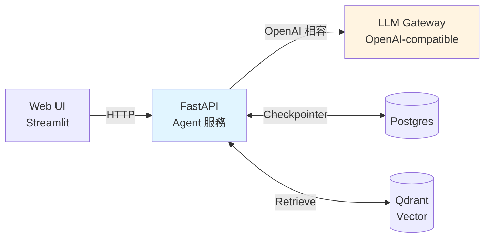

# 部署 LangGraph

三種主流部署方式。

## 方式一:LangGraph Platform(最省事)

LangChain 官方服務,上傳 graph 自動得到:
- HTTP API / SSE streaming
- Checkpointer(Postgres)
- Long-running job
- UI(LangGraph Studio)

```bash
# 專案根目錄要有 langgraph.json
{
  "graphs": {
    "my_agent": "./src/graph.py:graph"
  },
  "python_version": "3.12",
  "dependencies": ["."]
}
```

```bash
langgraph deploy
```

適合:快速 PoC、不想維運。

## 方式二:FastAPI 包 Graph(最彈性)

自己起 API,完全可控:

```python
# app.py
from fastapi import FastAPI
from fastapi.responses import StreamingResponse
from pydantic import BaseModel
from graph import build_graph  # 你的 graph

app = FastAPI()
graph = build_graph()

class ChatReq(BaseModel):
    thread_id: str
    message: str

@app.post("/chat")
async def chat(req: ChatReq):
    config = {"configurable": {"thread_id": req.thread_id}}
    result = await graph.ainvoke(
        {"messages": [("human", req.message)]},
        config=config,
    )
    return {"answer": result["messages"][-1].content}

@app.post("/chat/stream")
async def chat_stream(req: ChatReq):
    async def gen():
        config = {"configurable": {"thread_id": req.thread_id}}
        async for chunk in graph.astream(
            {"messages": [("human", req.message)]},
            config=config, stream_mode="messages",
        ):
            yield f"data: {chunk[0].content}\n\n"
    return StreamingResponse(gen(), media_type="text/event-stream")
```

跑:

```bash
uvicorn app:app --host 0.0.0.0 --port 8000 --workers 4
```

## 方式三:全在地部署(資料敏感)

把 Agent 與 LLM 後端都放公司內網 — LLM 後端(OpenAI 相容)由基礎設施團隊負責架設,Agent 端只需設定 `OPENAI_BASE_URL`:



重點元件與職責:

| 元件 | 職責 |
|------|------|
| Web UI | 使用者介面 |
| FastAPI Agent | 業務邏輯、State 管理 |
| LLM Gateway | 統一介面、token 計量、模型切換 |
| Postgres | Checkpointer(LangGraph state 持久化) |
| Qdrant / PGVector | 向量檢索(RAG) |

Agent 端範例 docker-compose 服務(**不含 LLM 後端**,由 infra 另外提供):

```yaml
services:
  agent-api:
    build: .
    ports: ["8000:8000"]
    environment:
      OPENAI_BASE_URL: http://llm-gateway:4000/v1
      OPENAI_API_KEY: ${LLM_GATEWAY_TOKEN}
    depends_on: [postgres, qdrant]

  postgres:
    image: postgres:16
    environment:
      POSTGRES_PASSWORD: devpass

  qdrant:
    image: qdrant/qdrant
    ports: ["6333:6333"]
```

## Checklist

部署前檢查:

- [ ] `.env` 不進 git,production 用 Secret Manager
- [ ] API 加認證(JWT / API key)
- [ ] 加 rate limit(fastapi-limiter)
- [ ] CORS 白名單
- [ ] Checkpointer 用 Postgres,不要 MemorySaver
- [ ] Observability 規劃(見 [Observability](./observability.md))
- [ ] Healthcheck endpoint(`/healthz`)
- [ ] 最大 recursion_limit 設定(防無限迴圈)
- [ ] Timeout 設定(防 hang)
- [ ] Log 進集中 log 平台(ELK / Grafana / CloudWatch)
