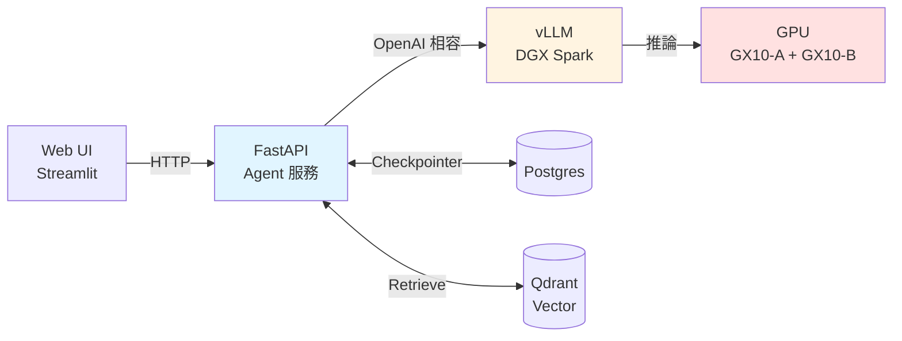

# 部署 LangGraph

三種主流部署方式。

## 方式一:LangGraph Platform(最省事)

LangChain 官方服務,上傳 graph 自動得到:
- HTTP API / SSE streaming
- Checkpointer(Postgres)
- Long-running job
- UI(LangGraph Studio)

```bash
# 專案根目錄要有 langgraph.json
{
  "graphs": {
    "my_agent": "./src/graph.py:graph"
  },
  "python_version": "3.12",
  "dependencies": ["."]
}
```

```bash
langgraph deploy
```

適合:快速 PoC、不想維運。

## 方式二:FastAPI 包 Graph(最彈性)

自己起 API,完全可控:

```python
# app.py
from fastapi import FastAPI
from fastapi.responses import StreamingResponse
from pydantic import BaseModel
from graph import build_graph  # 你的 graph

app = FastAPI()
graph = build_graph()

class ChatReq(BaseModel):
    thread_id: str
    message: str

@app.post("/chat")
async def chat(req: ChatReq):
    config = {"configurable": {"thread_id": req.thread_id}}
    result = await graph.ainvoke(
        {"messages": [("human", req.message)]},
        config=config,
    )
    return {"answer": result["messages"][-1].content}

@app.post("/chat/stream")
async def chat_stream(req: ChatReq):
    async def gen():
        config = {"configurable": {"thread_id": req.thread_id}}
        async for chunk in graph.astream(
            {"messages": [("human", req.message)]},
            config=config, stream_mode="messages",
        ):
            yield f"data: {chunk[0].content}\n\n"
    return StreamingResponse(gen(), media_type="text/event-stream")
```

跑:

```bash
uvicorn app:app --host 0.0.0.0 --port 8000 --workers 4
```

## 方式三:搭配本地 vLLM(千鉑課程用)

把 LLM 與 Agent 都在地端:



所有元件都可用 Docker compose:

```yaml
# docker-compose.yml(精簡版)
services:
  agent-api:
    build: .
    ports: ["8000:8000"]
    environment:
      OPENAI_BASE_URL: http://vllm:8000/v1
      OPENAI_API_KEY: EMPTY
    depends_on: [vllm, postgres, qdrant]

  vllm:
    image: vllm/vllm-openai:latest
    deploy:
      resources:
        reservations:
          devices: [{driver: nvidia, count: all, capabilities: [gpu]}]
    command: >
      --model meta-llama/Llama-3.3-70B-Instruct
      --tensor-parallel-size 2
      --enable-auto-tool-choice
      --tool-call-parser llama3_json

  postgres:
    image: postgres:16
    environment:
      POSTGRES_PASSWORD: devpass

  qdrant:
    image: qdrant/qdrant
    ports: ["6333:6333"]
```

詳細的 DGX Spark + Cloudflare Tunnel 設定,在 Claude Code 內呼叫 `/ainode-deploy` 或 `/cf-tunnel` skill。

## Checklist

部署前檢查:

- [ ] `.env` 不進 git,production 用 Secret Manager
- [ ] API 加認證(JWT / API key)
- [ ] 加 rate limit(fastapi-limiter)
- [ ] CORS 白名單
- [ ] Checkpointer 用 Postgres,不要 MemorySaver
- [ ] LangSmith tracing 開啟
- [ ] Healthcheck endpoint(`/healthz`)
- [ ] 最大 recursion_limit 設定(防無限迴圈)
- [ ] Timeout 設定(防 hang)
- [ ] Log 進 observability(ELK / Grafana)
