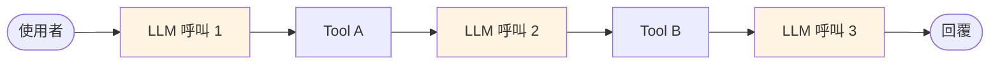

# Observability 與評估

生產級 Agent 必須能回答:

- 哪個使用者在什麼時候做了什麼?
- 延遲、token 成本多少?
- 哪些 prompt / tool 成功率高?
- Agent 卡在哪一步、為什麼輸出錯?

這就是 **Observability(可觀測性)**。本章介紹 **概念與方法**,不綁定特定 SaaS。

## Agent 為什麼特別難觀察

一般 Web API:一個 request 進、一個 response 出 → 看 access log 就夠。
Agent:一個請求可能 LLM → tool → LLM → tool → LLM,**多層巢狀呼叫**,錯誤傳播路徑長:



每一層都要能查:input / output / latency / cost / error。

## 可觀測性工具分類

| 類別 | 工具舉例 | 何時選 |
|------|----------|-------|
| **自建 logging** | Python `logging` / `structlog` + ELK / Grafana Loki | 已有成熟 infra,追求完全在地化 |
| **OpenTelemetry** | OTel SDK + Jaeger / Tempo | 跨服務 tracing、微服務架構 |
| **Agent 專用 SaaS** | LangSmith / Langfuse / Arize Phoenix | 要開箱可用、UI 查 trace |
| **LLM Gateway 內建** | LiteLLM `/spend/logs`、Portkey | 已經用 Gateway,直接看就好 |

:::info 本課程的做法
千鉑教室 LiteLLM Gateway 已經把 **每次 LLM 呼叫的 token / latency / user** 寫進 Postgres。老師從 Admin UI 就能看到各 key 的用量。學員端不需要另外做 SaaS 串接。
:::

## 方法 1:LangChain Callback(自建最小 observability)

LangChain / LangGraph 原生支援 callback,任何 LLM / tool / chain 發生時都會觸發:

```python
from langchain_core.callbacks import BaseCallbackHandler
import time, json, logging

log = logging.getLogger("agent")

class SimpleTracer(BaseCallbackHandler):
    def on_llm_start(self, serialized, prompts, **kwargs):
        self._t0 = time.time()
        log.info(json.dumps({"event": "llm_start", "prompts": prompts[:1]}))

    def on_llm_end(self, response, **kwargs):
        usage = getattr(response, "llm_output", {}).get("token_usage", {})
        log.info(json.dumps({
            "event": "llm_end",
            "elapsed": time.time() - self._t0,
            "usage": usage,
        }))

    def on_tool_start(self, serialized, input_str, **kwargs):
        log.info(json.dumps({"event": "tool_start", "tool": serialized.get("name"), "args": input_str}))

    def on_tool_end(self, output, **kwargs):
        log.info(json.dumps({"event": "tool_end", "output": str(output)[:200]}))
```

使用:

```python
from langchain_core.runnables import RunnableConfig

config = RunnableConfig(
    callbacks=[SimpleTracer()],
    tags=[f"user:{user_id}", f"session:{session_id}"],
    metadata={"user_id": user_id, "env": "prod"},
    run_name="customer-support",
)
agent.invoke(payload, config=config)
```

log 送到 ELK / Loki / CloudWatch 就能查。

## 方法 2:從 response 直接拿用量

每次 LLM 回應都帶 `usage_metadata`:

```python
result = agent.invoke(payload)
for m in result["messages"]:
    if hasattr(m, "usage_metadata"):
        print(m.usage_metadata)
# {'input_tokens': 123, 'output_tokens': 45, 'total_tokens': 168}
```

寫進 DB 就得到「每次呼叫 × 模型 × token」的原始資料,要多維分析隨時接 BI。

## 方法 3:Agent 專用 SaaS

如果不介意資料離開內網,市面有幾家 Agent-native 平台(LangSmith、Langfuse、Arize Phoenix 等)提供開箱 trace UI。本課程 **不涵蓋** SaaS 操作,但你知道它們存在 — 實務專案可依合規要求評估。

Langfuse 有官方 self-hosted Docker compose,可完全內網部署。

## 評估(Evaluation)

Observability 告訴你「發生什麼」,**Evaluation** 告訴你「做得好不好」。

### 建評估資料集

手工準備 10-30 組「題目 + 正解」:

```python
dataset = [
    {"question": "公司今年產假幾天?", "expected": "產假為..."},
    {"question": "幫我算 (3+4)*5",  "expected": "35"},
]
```

### 跑評估

```python
def run_agent(q: str) -> str:
    result = agent.invoke({"messages": [("human", q)]})
    return result["messages"][-1].content

def grade_llm(q: str, got: str, expected: str) -> bool:
    """用另一個 LLM 當裁判"""
    prompt = f"題目:{q}\n預期:{expected}\n實際:{got}\n\n實際答案是否正確?回 yes/no"
    return "yes" in grader_llm.invoke(prompt).content.lower()

results = []
for case in dataset:
    got = run_agent(case["question"])
    results.append({
        "q": case["question"],
        "pass": grade_llm(case["question"], got, case["expected"]),
    })

pass_rate = sum(r["pass"] for r in results) / len(results)
print(f"通過率: {pass_rate:.1%}")
```

每次 Agent prompt / 模型改動,跑一次比較通過率 — 避免改壞。

## 常見 KPI

| 指標 | 目標 |
|------|------|
| P95 latency | < 5s(chat)、< 30s(deep research) |
| Token 成本/請求 | 依模型與 use case 設門檻 |
| Tool 成功率 | > 95%(失敗會重試,但會放大延遲) |
| Grounded-ness(RAG 是否依資料回答) | > 90% |
| 使用者 thumbs-up 率 | > 80% |

## 警報

把異常指標接進 Slack / PagerDuty:

- P95 latency > 10s 連續 5 分鐘
- Error rate > 5%
- 單一使用者 run 數異常(濫用)
- Token 成本異常飆高

## 最小可行 Observability 清單

剛上線,先做到:

- [ ] 每次 request 有 `request_id`,貫穿所有 log
- [ ] LLM 呼叫記錄 input / output / tokens / latency
- [ ] Tool 呼叫記錄 name / args / result / error
- [ ] 錯誤有 stack trace
- [ ] 每日彙總:總請求數、平均延遲、錯誤率、token 用量
- [ ] 高風險 tool 另開審計 log(不可竄改)

再進階:trace ID、分散式追蹤、A/B 比較、Evaluation pipeline。

## 延伸閱讀

- OpenTelemetry 官方:[opentelemetry.io](https://opentelemetry.io)
- Langfuse(可 self-hosted 的 Agent observability):[langfuse.com](https://langfuse.com)
- LangChain Callbacks 文件:[docs.langchain.com](https://docs.langchain.com/)
