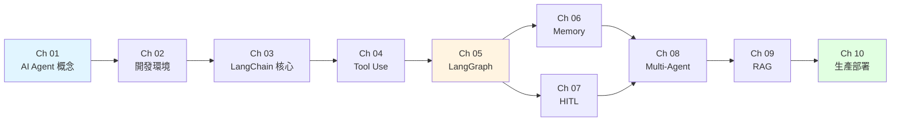

# AI Agent 實戰課程

本課程以 **LangChain / LangGraph** 為主軸,結合 Microsoft 官方的「AI Agents for Beginners」內容,帶你從零打造可上線的 AI Agent 系統。全程使用 Python,並以本地 vLLM(DGX Spark)為推理端點示範。

## 學習路徑

## 課程目標

完成本課程後,你能:

- 理解 AI Agent 與一般 LLM 應用的差異,以及何時該用 Agent。
- 用 LangChain 組裝模型、訊息、工具與結構化輸出。
- 用 LangGraph 建立帶狀態的工作流與多 Agent 系統。
- 實作 RAG、長期記憶與 Human-in-the-Loop。
- 在 DGX Spark 上以 vLLM 自架 OpenAI 相容 API。
- 用 LangSmith 做可觀測性、以 MCP 串接外部工具。

## 課程章節

| # | 章節 | 重點 |
|---|------|------|
| 01 | [AI Agent 概念](./01-foundation/what-is-agent.md) | 什麼是 Agent、Agent 類型、使用情境 |
| 02 | [開發環境](./02-environment/python-setup.md) | Python / API key / vLLM on DGX Spark |
| 03 | [LangChain 核心](./03-langchain-core/overview.md) | Models / Messages / Prompts / Structured Output / Streaming |
| 04 | [Tool Use](./04-tools/tool-concept.md) | 工具呼叫、自訂 Tool、Agent Loop |
| 05 | [LangGraph 入門](./05-langgraph-intro/why-graph.md) | StateGraph / Node / Edge / Reducer |
| 06 | [Memory 記憶](./06-memory/short-term.md) | 短期、摘要、外部儲存、長期記憶 |
| 07 | [Human-in-the-Loop](./07-hitl/breakpoints.md) | Breakpoint / Interrupt / 編輯 state |
| 08 | [Multi-Agent](./08-multi-agent/patterns.md) | Supervisor / 平行化 / 研究助理範例 |
| 09 | [RAG](./09-rag/rag-basics.md) | Vector Store / Retriever / Agentic RAG |
| 10 | [生產部署](./10-production/observability.md) | LangSmith / 部署 / MCP / Guardrails |

## 環境需求

- Python 3.11 / 3.12 / 3.13
- OpenAI / Anthropic API key(或自架 vLLM)
- LangSmith 帳號(免費層即可)
- DGX Spark(選配,課程後半會用到)

## 參考資料

本課程內容改編自:

- [LangChain 官方文件](https://docs.langchain.com/)(MIT 授權)
- [LangChain Academy](https://github.com/langchain-ai/langchain-academy)(MIT 授權)
- [Microsoft AI Agents for Beginners](https://github.com/microsoft/ai-agents-for-beginners)(MIT 授權)

:::tip 講師備忘
- 每章節後預留「討論題」與「延伸閱讀」連結。
- 範例程式碼都以 OpenAI 相容 API 撰寫,切換到本地 vLLM 只需改 `base_url`。
- 本 wiki 為千鉑科技內部教材,學員可查閱 [下載區](/docs/downloads) 取得完整 code sample。
:::
