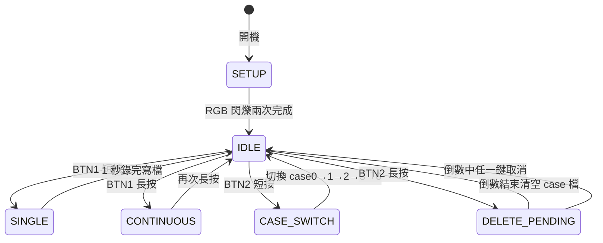

# 資料擷取

使用 `CollectData/CollectData.ino`（或命名簡寫版 `CollectDataV2/`）以按鈕驅動錄製 1 秒 IMU 樣本並寫入 SD 卡。本章介紹操作流程、檔案規範、品質檢查。

## 草稿選擇

| 草稿 | 差異 | 建議 |
| ---- | ---- | ---- |
| `CollectData/` | 變數名稱完整（`LED_PIN_R`、`imuSamples`），中英雙語註解 | **主流程，建議優先使用** |
| `CollectDataV2/` | 變數簡寫（`R / G / B`、`SIG_DATA`） | 若課程講義對齊此命名時使用 |

兩者功能、操作、產生的 CSV 完全相同。

## 系統狀態機



## LED 顏色語意

| 狀態 | LED 顏色 |
| ---- | ---- |
| case0 | 紅 |
| case1 | 綠 |
| case2 | 藍 |
| case3 | 白（R+G+B） |
| 錄製中 | 持續綠色 |
| 刪除倒數 | 紅色閃爍 |

## 實際操作流程

1. **開機** → RGB 閃爍兩次 → 進入 IDLE（預設 case0，紅色）。
2. **選擇動作類別** → 按 BTN2 循環切換 case，LED 顏色變化。
3. **錄製單筆** → 將板子維持目標動作（如「靜止」、「左右搖晃」），按 BTN1 短按 → 錄 1 秒 → 自動寫檔。
4. **批次錄製** → 長按 BTN1 → 持續做動作 → 再次長按停止。
5. **重複** 3–4 步驟，每個 case 建議至少收 30 筆樣本（共 120 筆起跳）。
6. **清除錯誤資料** → 切換到對應 case，長按 BTN2，5 秒內不取消就會清空該 case 全部樣本。

## CSV 檔案規範

檔名：

```
case<id>.sample<index>.csv
例：case0.sample1.csv、case3.sample120.csv
```

內容（1000 列 × 3 欄，單位 g，ASCII 純文字）：

```csv
-0.032,0.015,0.998
-0.031,0.016,0.997
...
（共 1000 列）
```

:::info 為何是 1 秒 / 1000 筆
MPU6050 設為 1 kHz 取樣，1 秒剛好 1000 筆。Edge Impulse 預設以 1 秒窗口做分類訓練，對應一個完整動作週期，兼顧辨識率與模型大小。
:::

## 動作類別設計建議

課程常用的四分類範例：

| case | 動作 | 特徵 |
| ---- | ---- | ---- |
| case0 | 靜止 | 三軸近似常數（Z ≈ 1 g） |
| case1 | 水平左右搖晃 | X 軸週期性變化 |
| case2 | 垂直上下晃動 | Z 軸週期性變化 |
| case3 | 旋轉 / 隨機揮動 | 三軸皆有高頻變化 |

實務上可根據實際應用改成：**正常／異常震動**、**走路／跑步／靜止**、**不同手勢** 等。

## 資料品質檢查

採集完一批後，務必：

1. 到 SD 卡看檔案大小是否一致（每檔約 24 KB）。
2. 用 Excel / Python 抽檢幾筆 CSV，確認：
   - 列數 = 1000（無截斷）
   - 三欄數值範圍在 ±2 g 內
   - 不同 case 的波形有視覺可辨的差異
3. 樣本數建議每個 case **至少 30 筆**，訓練 / 驗證 / 測試 70 / 15 / 15 分配。

:::warning 樣本分布
若某個 case 的樣本遠多於其他（例如 case0=200 筆、case1=20 筆），模型會嚴重偏向多數類別。採集時盡量保持平衡。
:::

## 下一步

有了乾淨的 CSV 資料，進入 [第 05 章：Edge Impulse 模型訓練](./05-edge-impulse.md)。
