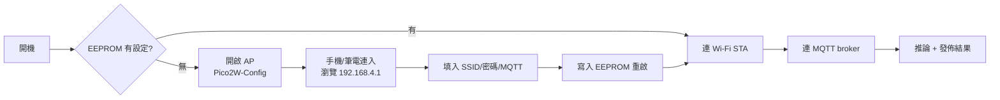

# Wi-Fi 配網與 MQTT 上傳

`MQTTwithAI/MQTTwithAI.ino` 整合推論 + Wi-Fi AP 配網 + MQTT 發佈，示範完整 AIoT 鏈路：**感測 → AI 推論 → 上雲**。

## 功能概覽



## 相依函式庫

```bash
arduino-cli lib install Button2 PubSubClient ArduinoJson
```

Edge Impulse library 需更名為 `EdgeAI_inferencing.h` 或改 `.ino` 首行的 `#include`。

## 預設參數

| 項目 | 值 | 備註 |
| ---- | ---- | ---- |
| 配網 AP SSID | `Pico2W-Config` | |
| 配網 AP 密碼 | `12345678` | ⚠ 教學用弱密碼，正式部署務必改 |
| 預設 MQTT broker | `mqtt.trillionsr.com.tw:1883` | 可於配網頁面改 |
| 狀態心跳 | 每 5 分鐘 | |
| 發佈節流 | 每 1 秒最多一筆 | |

## 配網操作

### 首次開機 / EEPROM 無效

1. 板子自動開啟 AP `Pico2W-Config`。
2. 手機連入該 AP（密碼 `12345678`）。
3. 瀏覽器開 `http://192.168.4.1`，出現設定表單。
4. 填入目標 Wi-Fi SSID / 密碼、MQTT server / port、device_id，送出。
5. 板子寫 EEPROM 並自動重啟，進入 STA 模式連上目標網路。

### 重新配網

**按住 GP2 接 GND 的時候再上電**，EEPROM 會被清空，回到配網模式。

## MQTT 主題規範

| 主題 | 方向 | Payload |
| ---- | ---- | ---- |
| `<device_id>/inference` | 上傳 | `{predicted_class, confidence, timestamp}` |
| `<device_id>/status` | 上傳 | `{uptime, rssi, free_heap}` |

範例 payload：

```json
{
  "predicted_class": "case1",
  "confidence": 0.934,
  "timestamp": 1713404820123
}
```

## 訂閱測試

以 MQTT Explorer（GUI）或 `mosquitto_sub`（CLI）訂閱：

```bash
mosquitto_sub -h mqtt.trillionsr.com.tw -p 1883 \
  -t "+/inference" -v
```

看到 JSON 不斷湧入就代表整條鏈路通了。

## 整合到儀表板

常見串接方案：

| 工具 | 用途 |
| ---- | ---- |
| Node-RED | 拉 MQTT → 邏輯 → Dashboard，適合 PoC |
| Home Assistant | 智慧家庭場景、觸發自動化 |
| InfluxDB + Grafana | 時序資料庫 + 圖表 |
| Supabase / Firebase | 雲端應用串接 |

:::tip Broker 選擇
- 課堂用：預設的 `mqtt.trillionsr.com.tw`（公開教學 broker）。
- 內部生產：自架 Mosquitto 或走 Emqx，並啟用 TLS + 帳密驗證。
- 快速 PoC：HiveMQ Cloud / EMQX Cloud 免費 tier。
:::

## 安全性建議

目前草稿為了教學便利犧牲了一些安全性，**上線前請依下列項目強化**：

- [ ] AP 密碼由 `12345678` 改為隨機強密碼
- [ ] MQTT 啟用 TLS（`1883` → `8883`）
- [ ] 使用帳密或 client certificate 驗證
- [ ] device_id 不要外露在 topic 首段（可用 hash）
- [ ] OTA 升級機制（Pico 2 W 配合 `Updater.h` 可做 HTTP OTA）

## 效能與阻塞

本草稿 Wi-Fi、MQTT、推論共用 Core 0；連線異常時會阻塞推論迴圈。若要避免：

- 把推論放 Core 1（Pico 2 W 雙核，`setup1()` / `loop1()`）。
- MQTT reconnect 用 state machine，避免 busy wait。
- 若需要穩定 1 kHz 取樣，用 `repeating_timer` 中斷而非 `delay()`。

## 與 DHT11MQTT 的關係

`DHT11MQTT/DHT11MQTT.ino` 是平行示範：把 MPU6050 換成 DHT11 溫濕度，其餘 Wi-Fi / MQTT 程式碼幾乎一樣。用來示範「同一套 AIoT 骨架，可以套任何感測器」。詳情見 [第 08 章](./08-troubleshooting.md)。

## 下一步

[第 08 章：常見問題與延伸應用](./08-troubleshooting.md)。
