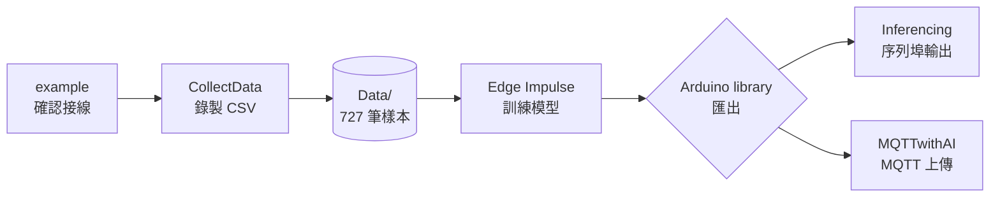

# AI × IMU 感測實戰

以 **Raspberry Pi Pico 2 W + MPU6050 三軸 IMU** 為教材，示範一條完整的 AIoT 鏈路：從硬體接線、按鈕驅動的資料擷取、Edge Impulse 模型訓練，到裝置端即時推論與 Wi-Fi / MQTT 上傳。

> 配套 GitHub 專案：[harry123180/AIforSensor-MPU6050](https://github.com/harry123180/AIforSensor-MPU6050)

## 學習成果

完成本課程後，學員將能：

- 獨立完成 Pico 2 W 與 MPU6050、RGB LED、按鈕、SD 卡的接線與自測。
- 用按鈕分類錄製 1 kHz 加速度資料並寫入 SD 卡。
- 將資料匯入 Edge Impulse Studio，訓練並匯出 TinyML 模型。
- 在裝置上進行即時動作分類，並透過 MQTT 上傳結果到雲端 broker。

## 適合對象

- 具備基本 Arduino 操作經驗、懂 C / C++ 語法者。
- 想把 AI 從電腦訓練延伸到 MCU 裝置的嵌入式工程師、學生。
- 需要動作／震動訊號分類（如姿態偵測、機械異常）的應用開發者。

## 硬體清單（BOM）

| 項目 | 規格 | 備註 |
| ---- | ---- | ---- |
| MCU | Raspberry Pi Pico 2 W | 內建 Wi-Fi，支援 arduino-pico |
| IMU | MPU6050 模組（GY-521） | I2C，3.3V 供電 |
| 共陰極 RGB LED | 直插或模組 | 3 顆限流電阻（330 Ω）|
| 按鈕 × 2 | 輕觸開關 | 另一端接 GND |
| MicroSD 卡 + 讀卡模組 | FAT16/32 格式 | SPI 介面 |
| 麵包板、杜邦線 | — | 或使用專案 PCB（見 [硬體與接線](./01-hardware-setup.md)） |

:::tip 替代方案
課堂若已備妥教學板 PCB（見 [GitHub repo 的 `PCB/`](https://github.com/harry123180/AIforSensor-MPU6050/tree/main/PCB)），可直接焊接省去麵包板佈線。
:::

## 整體資料鏈路

## 章節導覽

| # | 主題 | 對應草稿 |
| --- | ---- | ---- |
| 01 | [硬體與接線](./01-hardware-setup.md) | PCB、腳位總表 |
| 02 | [開發環境與工具鏈](./02-environment.md) | Arduino IDE / arduino-cli |
| 03 | [周邊自測草稿](./03-peripheral-tests.md) | RGBLEDCode、BTNCode、SDCardWrite、MPU6050Code、example |
| 04 | [資料擷取](./04-data-collection.md) | CollectData / CollectDataV2 |
| 05 | [Edge Impulse 模型訓練](./05-edge-impulse.md) | Data/ → Studio |
| 06 | [裝置端推論](./06-inference.md) | Inferencing |
| 07 | [Wi-Fi 配網與 MQTT 上傳](./07-aiot-mqtt.md) | MQTTwithAI |
| 08 | [常見問題與延伸應用](./08-troubleshooting.md) | DHT11MQTT、WifiConnector |

## 建議學習時程

- **一日工作坊**：第 01 ~ 04 章（接線 → 擷取資料，午餐前完成）＋ 下午 05 ~ 06（訓練與推論）。
- **兩日工作坊**：加入第 07 章（AIoT 整合）與第 08 章（延伸應用）。
- **自學**：建議依章節順序進行，每章預留 1 ~ 2 小時動手實作。
