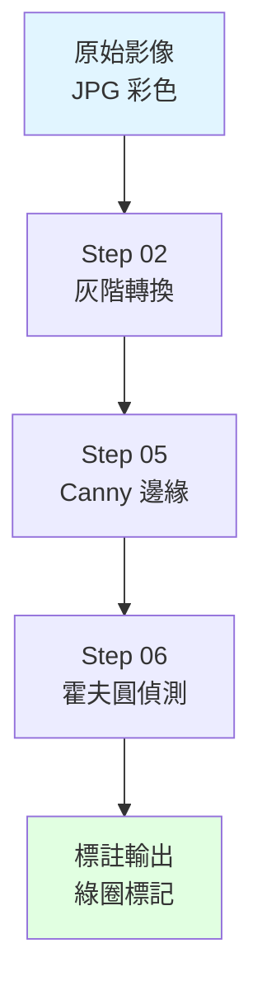

# DAY1：OpenCV 入門練習

> **主題**：熟悉影像讀取、轉換、幾何操作與簡易檢測
> **對應 Repo 資料夾**：[`DAY1/`](https://github.com/harry123180/ComputerVisioncourse/tree/main/DAY1)

## 學習目標

1. 用 OpenCV 讀取 / 顯示 / 儲存影像，並理解 **BGR vs RGB** 的差異
2. 掌握常見前處理流程：灰階、縮放、高斯模糊
3. 能在影像上繪製圖形與文字，做為標註輸出基礎
4. 使用 **Canny** 邊緣偵測與 **霍夫圓形偵測** 做簡單物件定位
5. 建立「讀檔 → 前處理 → 偵測 → 標註 → 輸出」的完整思維流程

## 先備知識

- Python 基礎語法（函式、迴圈、路徑操作）
- 命令列基本操作（啟動虛擬環境、`pip install`）

---

## 腳本一覽

| 步驟 | 檔案 | 功能 |
|------|------|------|
| Step 01 | `step01_read_image.py` | 讀取並顯示影像 |
| Step 02 | `step02_to_grayscale.py` | 灰階轉換 |
| Step 03 | `step03_resize_image.py` | 等比例縮放 |
| Step 04 | `step04_draw_shapes.py` | 繪製矩形與文字 |
| Step 05 | `step05_detect_edges.py` | Canny 邊緣偵測 |
| Step 06 | `step06_detect_circles.py` | 霍夫圓形偵測 |
| Step 07 | `step07_dual_camera.py` | 雙攝影機 + Mediapipe（銜接 DAY2） |

---

## 環境準備

```bash
pip install opencv-python numpy
# step07 需額外安裝
pip install mediapipe
```

---

## 來源影像說明

本課程使用 **台灣硬幣** 作為圓形偵測素材，分三種光源場景：

| 子資料夾 | 說明 | 使用時機 |
|----------|------|----------|
| `frontlit_detail/` | 正面打光（可見硬幣細節） | Step01 ~ Step06 預設讀取 |
| `backlit_silhouette/` | 背光剪影（高對比輪廓） | 練習高對比偵測 |
| `lowlight_ambient/` | 低光環境 | 練習低對比、HDR、CLAHE |

:::tip 替換成自己的素材
直接把你自己的硬幣 / 圓形物體照片放進 `frontlit_detail/`，腳本會自動讀取第一張 `.jpg`。
:::

---

## 腳本說明

### Step 01：讀取並顯示影像

```python
image = cv2.imread(str(image_path))
cv2.imshow("Day1 Step01", image)
cv2.waitKey(0)
```

:::warning cv2.imshow 一開就關？
少了 `cv2.waitKey(0)`。`0` 代表等待任意鍵才關閉。
:::

---

### Step 02：灰階轉換

```python
gray = cv2.cvtColor(image, cv2.COLOR_BGR2GRAY)
```

灰階影像只有一個通道，減少運算量，是多數後續處理（邊緣、二值化、模板比對）的前置步驟。

---

### Step 03：調整影像尺寸

```python
resized = cv2.resize(image, target_size, interpolation=cv2.INTER_AREA)
```

縮圖用 `INTER_AREA` 最平滑；放大用 `INTER_CUBIC` 或 `INTER_LINEAR`。

---

### Step 04：繪製圖形標註

```python
cv2.rectangle(image, top_left, bottom_right, (0, 255, 0), 3)
cv2.putText(image, "Demo Box", pos, font, scale, color, thickness)
```

:::info 顏色是 BGR
OpenCV 預設是 **BGR** 順序，不是 RGB。綠色是 `(0, 255, 0)`、紅色是 `(0, 0, 255)`。
:::

---

### Step 05：Canny 邊緣偵測

```python
blurred = cv2.GaussianBlur(image, (5, 5), 0)
edges = cv2.Canny(blurred, 80, 160)
```

**為什麼要先模糊？** Canny 對雜訊敏感，先用高斯模糊做平滑可大幅減少偽邊緣。

低閾值 / 高閾值經驗值：

| 場景 | 建議 |
|------|------|
| 清晰產品照 | `50, 150` 或 `80, 160` |
| 低光影像 | `30, 90` |
| 高雜訊 | 加大模糊 kernel 到 `(7,7)` 或 `(9,9)` |

---

### Step 06：霍夫圓形偵測

```python
circles = cv2.HoughCircles(
    blurred,
    cv2.HOUGH_GRADIENT,
    dp=1.2,
    minDist=40,
    param1=120,
    param2=35,
    minRadius=10,
    maxRadius=200,
)
```

| 參數 | 作用 |
|------|------|
| `dp` | 累加器解析度反比，值越大越模糊 |
| `minDist` | 兩圓心最短距離（避免重複） |
| `param1` | 傳給內部 Canny 的高閾值 |
| `param2` | 累加器閾值，**值越小偵測越多** |
| `minRadius / maxRadius` | 限制搜尋的半徑範圍，**一定要設**，不然會爆 |

---

### Step 07：雙攝影機 + Mediapipe（銜接 DAY2）

同時開兩支攝影機：

- Camera 0 → Mediapipe **FaceMesh**（468 點網格 + 虹膜）
- Camera 1 → Mediapipe **Pose**（33 點骨架）

| 按鍵 | 功能 |
|------|------|
| `ESC` | 結束 |
| `v` | 切換水平並排 / 垂直堆疊 |

**效能重點**：

```python
rgb = cv2.cvtColor(frame, cv2.COLOR_BGR2RGB)
rgb.flags.writeable = False   # 讓 Mediapipe 免於複製資料
result = pose.process(rgb)
```

:::note 只有一支攝影機？
可以略過 step07，直接進 DAY2 的單鏡頭範例。
:::

---

## 處理流程圖



---

## 常見問題

### Q1：`cv2.imread()` 回傳 `None`？
- **檔案路徑含中文或空白**：改用
  ```python
  cv2.imdecode(np.fromfile(path, np.uint8), cv2.IMREAD_COLOR)
  ```
- **副檔名大小寫錯誤**：`Path.glob("*.jpg")` 在 Windows 不分大小寫，Linux 分，請檢查真實檔名

### Q2：HoughCircles 偵測不到圓 / 誤判太多？
- 先把影像縮到 `1024px` 以內，避免計算量爆炸
- 調 `param2`：值越低越容易偵測（也越多雜訊）
- 調 `minRadius / maxRadius` 限制搜尋範圍
- 低光影像先套 `cv2.equalizeHist` 或 CLAHE 提升對比

### Q3：輸出圖顏色偏藍 / 偏黃？
OpenCV 預設 **BGR**，若丟進 matplotlib（RGB）會色彩反轉，記得先 `cv2.cvtColor(image, cv2.COLOR_BGR2RGB)`。

---

## 延伸任務

- 寫 `step08_count_coins.py`，結合 step05 + step06 計算硬幣數量並疊加於畫面
- 把 step06 改為讀取整個 `lowlight_ambient/` 資料夾，比較偵測準確率
- 嘗試替換成你自己的硬幣或圓形物體照片
- 結合 DAY4 的 BMP 高解析影像再跑一次

**下一站**：[DAY2 — Mediapipe 姿勢辨識](./day2-mediapipe-pose)
