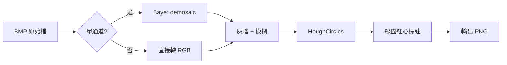

# DAY4：高解析影像處理

> **主題**：處理工業相機輸出的高解析度 BMP 影像，並找出圓點標記
> **對應 Repo 資料夾**：[`DAY4/`](https://github.com/harry123180/ComputerVisioncourse/tree/main/DAY4)

## 學習目標

1. 理解工業相機常見的 **Bayer 色彩編碼**，並能正確解碼還原
2. 處理大尺寸 BMP 影像，避免記憶體與顯示問題
3. 使用 `HoughCircles` 進行圓點定位，並調整關鍵參數
4. 將 DAY1 的圓形偵測技巧搬到產線等級的真實影像

## 先備知識

- DAY1 的 OpenCV 基礎（讀檔、灰階、高斯模糊、HoughCircles）
- 對像素色彩有基本概念（RGB / BGR）

---

## 腳本

| 檔案 | 功能 |
|------|------|
| `circle_marker_detector.py` | 圓點偵測主程式 |

執行：

```bash
pip install opencv-python numpy
python circle_marker_detector.py
```

輸出會放在 `output/circle_result.png`。

---

## 核心概念

### 什麼是 Bayer 影像？

工業相機為了降低成本與頻寬，感光元件（CMOS）通常只在每個像素位置放 **單一** 色彩濾鏡（R、G 或 B），以特定陣列排列：

```
BayerGR         BayerBG         BayerRG         BayerGB
G R G R ...     B G B G ...     R G R G ...     G B G B ...
R G R G ...     G R G R ...     G B G B ...     B G B G ...
```

原始輸出是 **單通道灰度圖**，需要 **去馬賽克 (demosaic)** 才能還原成三通道彩色影像：

```python
cv2.cvtColor(image, cv2.COLOR_BayerGR2RGB)
cv2.cvtColor(image, cv2.COLOR_BayerBG2BGR)
# ...
```

:::tip 如何判斷是哪種 Bayer？
通常由相機廠商規格決定。若不確定，**逐一試四種**，肉眼看哪種色彩正確即可。
:::

### HoughCircles 參數調校

```python
circles = cv2.HoughCircles(
    blurred,
    cv2.HOUGH_GRADIENT,
    dp=1.2,        # 累加器解析度反比
    minDist=40,    # 兩圓心最短距離
    param1=120,    # Canny 高閾值
    param2=40,     # 累加器閾值，值越小偵測越多
    minRadius=10,
    maxRadius=80,
)
```

| 問題 | 調整方向 |
|------|----------|
| 偵測不到圓 | `param2 ↓`、`minRadius ↓` |
| 誤判太多 | `param2 ↑`、`minDist ↑` |
| 大小圓都要抓 | 拉大 `minRadius / maxRadius` 範圍，或跑兩次 |
| 高解析度很慢 | 先 `cv2.resize` 縮小、處理完再 scale 回去 |

---

## 執行流程

`circle_marker_detector.py` 會依序：

1. 讀取 `images/high_res_sample.bmp`
2. 若是單通道（Bayer）以 `COLOR_BayerGR2RGB` 解碼；若已是彩色則直接轉 RGB
3. 灰階 → 高斯模糊 → HoughCircles
4. 在原圖上用 **綠色圓 + 紅色圓心** 標示結果
5. 輸出 `output/circle_result.png`，console 印出偵測到幾個圓



---

## 常見問題

### Q1：`OpenCV 無法讀取示範圖片`？
- 檢查 `images/high_res_sample.bmp` 是否存在
- BMP 太大（> 500MB）時，部分平台需升級 OpenCV

### Q2：顏色偏紫 / 偏綠？
Bayer 排列判斷錯誤，改用其他 `COLOR_BayerBG2RGB`、`COLOR_BayerRG2RGB`、`COLOR_BayerGB2RGB`。

### Q3：顯示視窗太大超出螢幕？
- 先 `cv2.resize` 縮小到 `1280x720` 再 `imshow`
- 或用 `cv2.namedWindow("x", cv2.WINDOW_NORMAL)` 讓視窗可縮放

### Q4：輸出圖顏色偏藍？
程式最後 `cv2.imwrite` 前做了 `cvtColor(annotated, COLOR_RGB2BGR)`，確認這行沒被改掉。

---

## 延伸應用

- **幾何量測**：搭配 `calibration_chessboard/` 做 `cv2.calibrateCamera`，像素距離換算毫米
- **定位應用**：多圓點可用於 PCB 對位、AOI 自動光學檢測
- **速度優化**：先縮圖偵測 → 在原圖 ROI 精修，可大幅降低運算量
- **影像拼接**：高解析度相機 + 移動平台，可把多張圖拼成超高解析度全景

**下一站**：[DAY5 — CustomTkinter GUI](./day5-customtkinter-gui)
