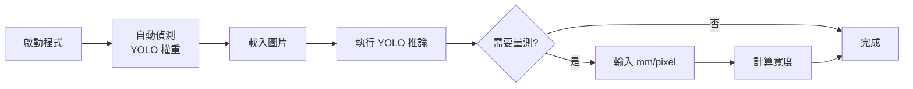

# DAY6：智慧視覺檢測整合

> **主題**：將 GUI、YOLO 與量測流程串接成示範工具
> **對應 Repo 資料夾**：[`DAY6/`](https://github.com/harry123180/ComputerVisioncourse/tree/main/DAY6)

## 學習目標

1. 把 [DAY3](./day3-yolo-finetune) 訓練好的 YOLO 權重載入到 GUI 應用中
2. 解析 Ultralytics `results.boxes` 的內容（座標、類別、信心度）
3. 利用 **像素 → 毫米** 換算，在偵測框上加上實際尺寸標註
4. 使用 **PyInstaller** 將整個應用打包成單一可執行檔
5. 理解「從模型訓練到桌面應用」的完整產線思路

## 先備知識

- [DAY3](./day3-yolo-finetune) 的 YOLO 訓練流程
- [DAY5](./day5-customtkinter-gui) 的 CustomTkinter 基礎
- `pathlib.Path` 路徑操作

---

## 腳本

| 檔案 | 功能 |
|------|------|
| `smart_inspection_app.py` | 主程式 |
| `smart_vision_tool.spec` | PyInstaller 打包設定 |
| `assets/application.png` / `.ico` | 應用圖示 |

執行：

```bash
pip install customtkinter ultralytics opencv-python pillow
python smart_inspection_app.py
```

---

## 核心概念

### YOLO 權重自動搜尋

程式啟動時會依序嘗試：

```
1. ../DAY3/runs/demo_yolo11/weights/best.pt   ← 自訓硬幣模型（推薦）
2. ../DAY3/models/yolo11n.pt                  ← 原始預訓練權重（COCO 80 類）
```

兩個都找不到時，GUI 會跳提醒但仍可啟動（只是不能按推論）。

### 解析 YOLO 推論結果

`model.predict()` 回傳 `results` 是一個 list，每張圖一個 Result，每個 Result 的 `boxes` 包含所有框：

```python
for box in result.boxes:
    x1, y1, x2, y2 = box.xyxy[0].tolist()  # 左上/右下座標
    confidence = float(box.conf[0])         # 信心度 0~1
    cls_id = int(box.cls[0])                # 類別索引
    label = model.names[cls_id]             # 類別名稱
```

### 像素 ↔ 毫米換算

真實量測需要先校正：**在拍攝環境下，一個像素等於多少毫米？**

簡易作法：放一個已知大小的物體（例如 10 cm 尺），量出它佔多少像素：

```
mm_per_pixel = 真實毫米 / 像素長度
```

本範例直接讓使用者輸入這個值（預設 `0.10`），然後：

```python
mm_width = pixel_width * ratio
```

:::info 要更精準？
做 **雙點校正**，或加上相機內參校正（可用 [DAY4](./day4-high-res-image) 的 `calibration_chessboard/` 棋盤圖）。
:::

---

## 使用流程



### Step 1：啟動程式
自動偵測 YOLO 權重（見上方搜尋邏輯）。

### Step 2：載入圖片
點「載入圖片」選要檢測的圖。

### Step 3：執行推論
點「執行 YOLO 推論」，系統自動標註偵測結果，右側顯示「偵測到 N 個物件」。

### Step 4：尺寸換算（選用）
輸入 mm/pixel 值（預設 `0.10`），按「計算寬度」即可估算每個偵測框的實際寬度。

---

## 功能說明

| 功能 | 說明 |
|------|------|
| 載入圖片 | 從檔案系統選擇圖片 |
| YOLO 推論 | 執行物件偵測並標註結果 |
| 像素換算 | 輸入 mm/pixel 比例 |
| 計算寬度 | 將最近一次推論結果的像素寬度轉毫米 |

---

## 打包獨立執行檔（選用）

課程附上 `smart_vision_tool.spec`，可用 [PyInstaller](https://pyinstaller.org/) 打包成單一 `.exe`：

```bash
pip install pyinstaller
pyinstaller smart_vision_tool.spec
```

打包完成後會在 `dist/smart_vision_tool/` 取得可執行檔，圖示自動套用 `assets/application.ico`。

:::warning 打包體積
首次打包會花幾分鐘收集 `ultralytics` 與 `torch` 的相依檔，成品體積通常 **400MB ~ 1GB**。
:::

---

## 常見問題

### Q1：啟動時跳「未安裝 ultralytics」？
`pip install ultralytics` 即可。若已裝仍跳，代表程式跑在別的 Python 環境。

### Q2：「找不到 YOLO 權重」？
先回到 [DAY3](./day3-yolo-finetune) 執行 `python download_weights.py`，或跑完 `python train_yolo.py`。

### Q3：推論完沒有框？
- 圖片內容可能不在模型訓練類別中（例如硬幣模型看到汽車）
- 信心度太低：在 `predict` 加 `conf=0.1`

### Q4：尺寸換算的數字差很多？
- `mm/pixel` 值依拍攝距離、鏡頭焦距而異，**不是固定的**
- 建議先用尺拍照量實際比例再輸入

---

## 延伸建議

- 將像素換算改為 **雙點校正**：讓使用者在圖上點兩個點定義已知長度
- 加入攝影機即時串流模式，模擬產線檢測
- 搭配 [DAY5](./day5-customtkinter-gui) 介面改造，加入報表輸出與歷史紀錄
- 使用 `assets/` 的圖示，打包成獨立桌面應用
- 串接資料庫（SQLite），記錄每次檢測結果與時間

---

## 課程總結

恭喜完成 6 日課程！你已經：

- ✅ 熟悉 OpenCV 的影像讀取、前處理、偵測
- ✅ 用 Mediapipe Pose 做即時姿勢分析
- ✅ 跑過 YOLO11 的完整訓練流程
- ✅ 處理工業相機的高解析 Bayer 影像
- ✅ 用 CustomTkinter 做出桌面 GUI
- ✅ 把訓練好的模型整合成可打包的 `.exe` 應用

下一步建議：拿自己的題目（PCB AOI、瓶蓋檢測、交通流量統計...）套用這一整套流程。

**回到**：[課程總覽](./overview)
