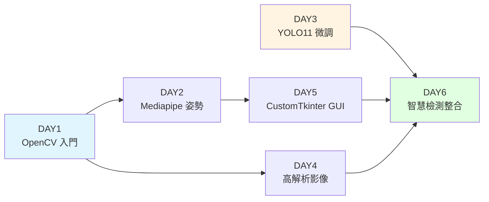

# Computer Vision 6 日課程

> **作者**：harry123180 &nbsp;·&nbsp; **GitHub Repo**：[harry123180/ComputerVisioncourse](https://github.com/harry123180/ComputerVisioncourse)

這套 6 日課程帶你從 OpenCV 的影像基本操作，一路做到 YOLO11 模型微調、CustomTkinter GUI 整合，最後封裝成桌面端「智慧視覺檢測工具」。每一天都對應一個獨立主題，可依序學習、也可以挑感興趣的章節直接切入。

## 學習路徑



## 課程目標

完成本課程後，你能：

- 熟練 OpenCV 讀檔、前處理、繪圖與經典偵測演算法（Canny、HoughCircles）
- 用 Mediapipe Pose 做即時骨架偵測、離線影片分析與動作計數
- 完整跑過 YOLO11 的資料集 → 訓練 → 驗證 → 推論流程
- 處理工業相機的 Bayer 高解析影像並進行圓點定位
- 以 CustomTkinter 把 OpenCV 工作流包裝成桌面 GUI
- 把訓練好的 YOLO 模型整合進 GUI，完成「像素 → 毫米」尺寸量測並打包成 `.exe`

## 章節一覽

| 天 | 主題 | 重點技術 |
|----|------|----------|
| [環境設定](./environment-setup) | 從零安裝 Python + VSCode + 虛擬環境 | Python 3.10+ / venv / pip |
| [DAY1](./day1-opencv-basics) | OpenCV 入門 | imread / cvtColor / Canny / HoughCircles |
| [DAY2](./day2-mediapipe-pose) | Mediapipe 姿勢辨識 | Pose 33 landmarks / 軀幹角度 / 深蹲計數 |
| [DAY3](./day3-yolo-finetune) | YOLO11 微調 | Ultralytics / data.yaml / mAP |
| [DAY4](./day4-high-res-image) | 高解析影像處理 | Bayer demosaic / HoughCircles 調參 |
| [DAY5](./day5-customtkinter-gui) | CustomTkinter GUI | BGR → RGB → PIL → Tk / 物件導向 GUI |
| [DAY6](./day6-smart-inspection) | 智慧檢測整合 | YOLO 推論 / mm/pixel 換算 / PyInstaller |

## 環境需求

- Python **3.10+**（建議 3.10 或 3.11）
- 建議使用 `python -m venv .venv` 建立虛擬環境
- 依各日 README 安裝對應套件：`opencv-python`、`mediapipe`、`ultralytics`、`customtkinter`、`pillow`

:::tip 完全新手？
請先從 [環境設定](./environment-setup) 開始，有完整圖文教學帶你從零安裝 Python、VSCode 與虛擬環境。
:::

## 快速開始

```bash
# 1. clone repo
git clone https://github.com/harry123180/ComputerVisioncourse.git
cd ComputerVisioncourse

# 2. 建立虛擬環境
python -m venv .venv
.venv\Scripts\activate        # Windows
# source .venv/bin/activate   # macOS / Linux

# 3. 安裝全部依賴
pip install -r requirements.txt

# 4. 從 DAY1 開始
cd DAY1
python step01_read_image.py
```

## 資料夾結構一覽

```
ComputerVisioncourse/
├── DAY1/                # OpenCV 入門（含 images/ output/ step01~07 腳本）
├── DAY2/                # Mediapipe 姿勢分析
├── DAY3/                # YOLO11 微調（dataset / models / runs）
├── DAY4/                # 高解析影像處理
├── DAY5/                # CustomTkinter GUI
├── DAY6/                # 智慧檢測整合（含 PyInstaller spec）
├── tools/               # 共用工具腳本（硬幣 pipeline、ROI 截圖工具等）
├── calibration_chessboard/  # 相機校正棋盤
├── training_data/       # ML 訓練素材（Front / Back 零件）
├── video/               # Mediapipe demo 影片
├── ppts/                # 課程簡報
├── docs/setup_guide/    # 環境設定截圖
├── requirements.txt     # 根目錄統一依賴
└── README.md
```

## 推薦學習順序

1. **先跑一遍 DAY1**：建立「讀檔 → 前處理 → 偵測 → 標註 → 輸出」思維。
2. **DAY2 / DAY4 擇一延伸**：對人體分析有興趣走 DAY2，想做產線量測直接跳 DAY4。
3. **DAY3 訓練你自己的 YOLO 模型**：完成後把 `best.pt` 留給 DAY6 使用。
4. **DAY5 + DAY6 串成應用**：把前幾天的成果包進 GUI，最後用 PyInstaller 打包成桌面工具。

## 相關資源

- **GitHub Repo**：[harry123180/ComputerVisioncourse](https://github.com/harry123180/ComputerVisioncourse)
- **OpenCV 官方文件**：[docs.opencv.org](https://docs.opencv.org/4.x/)
- **Mediapipe 官方文件**：[developers.google.com/mediapipe](https://developers.google.com/mediapipe)
- **Ultralytics YOLO11**：[docs.ultralytics.com](https://docs.ultralytics.com/)
- **CustomTkinter 文件**：[customtkinter.tomschimansky.com](https://customtkinter.tomschimansky.com/)

:::info 講師備忘
- 每一天都有獨立 README、可執行腳本、範例素材與輸出結果。
- 教學建議以「現場 demo → 學員照抄 → 延伸任務」三階段進行。
- DAY5 / DAY6 的 GUI 若要上台投影，建議把視窗大小固定在 1280×720 以下。
:::
